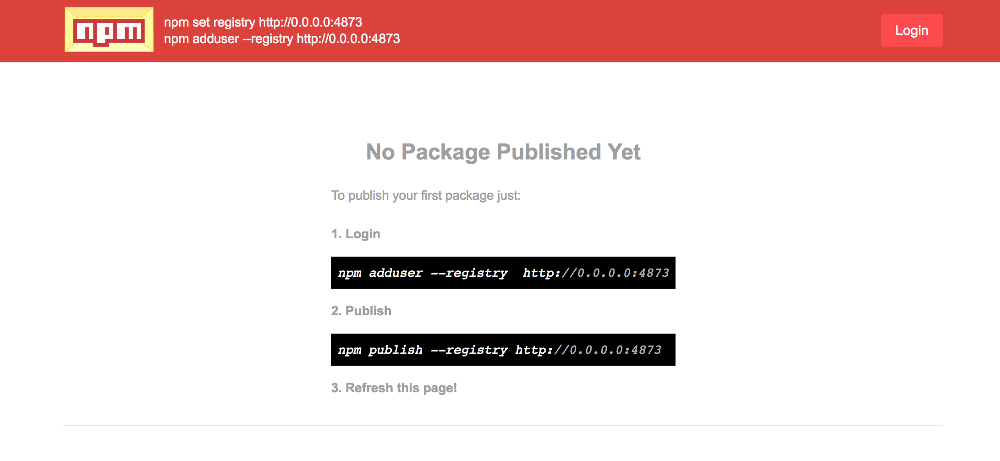

当公司到达一定程度，为了提高前端的开发效率，公司内部会创造一系列的框架或者工具库。这些包肯定是不可以暴露到外网之外的，所以你可以搭建一个私有的 npm。如果你们公司较为富有，其实直接用 npm 的企业版也是很不错的。

## 前言

公司现在前端已经有四人了，技术栈包括 React 和 Vue 等，公司项目十分多。每个项目都有一些共同的部分，例如：JS 和 Native 通信封装，Universal Link，共有的一些工具方法（文件上传，时间价格格式化等）等。想要提高开发效率，第一步就是提取公共部分，减少重复劳动。这些公共部分不能存储在外网。因此需要内网搭建私有 npm 镜像。

## verdaccio

[verdaccio](https://github.com/verdaccio/verdaccio) 是我去年很早就开始关注的一个项目了。这也是这篇文章的主角。

*注意：下面内容牵扯到一些 docker 基础内容，这里不做教学，如果你不了解 docker，可以去看一下阮一峰大神的 [docker 入门基础](http://www.ruanyifeng.com/blog/2018/02/docker-tutorial.html)*


### 拉取镜像

verdaccio 是支持 docker 的。

```bash
# 拉取 verdaccio 镜像
> docker pull verdaccio/verdaccio

# 查看 本地所有镜像
> docker images

## 你可能会看到如下结果
# REPOSITORY            TAG                 IMAGE ID            CREATED             SIZE
# verdaccio/verdaccio   latest              cab129e3f6f6        4 weeks ago         345MB
```

因为镜像默认是从 dockerhub 拉取的，所以你可能会卡在这个地方。

如果你一直拉取不下来，你可以设置代理。我是用的是 [daocloud.io](http://www.daocloud.io/mirror#accelerator-doc)，他提供免费的镜像加速服务。你只需要注册个账号，然后访问 [http://www.daocloud.io/mirror#accelerator-doc](http://www.daocloud.io/mirror#accelerator-doc)，根据页面上的文档设置就行了。

### 启动容器

在 docker 的概念中。镜像你可以理解为模板，容器可以理解为由镜像产生的实例。

```bash
# 创建一个 verdaccio 镜像的容器
> docker run -it --rm --name verdaccio -p 4873:4873 verdaccio/verdaccio

## 你可以看到如下类似的输出
# > docker run -it --rm --name verdaccio -p 4873:4873 verdaccio/verdaccio
# warn --- config file  - /verdaccio/conf/config.yaml
# warn --- http address - http://0.0.0.0:4873/ - verdaccio/2.7.4
```

访问 `http://0.0.0.0:4873/#/` 你会看到如下页面：



然后你就可以按照如上方式进行包的提交了。

但是到这里，这篇文章可没有结束，才是开始。

### 后台运行

运行上一节的指令后，当你按 `ctrl/cmd + c` 之后，网页无法访问了。这里我们需要对上面的指令进行修改

```bash
# 后台运行容器
> docker run -it -d --name verdaccio -p 4873:4873 verdaccio/verdaccio

# 查看正在运行容器
> docker ps

## 你可以看到如下结果
# CONTAINER ID        IMAGE                 COMMAND                  CREATED             STATUS              PORTS                    NAMES
# c7bd43009fbe        verdaccio/verdaccio   "/usr/local/bin/dumb…"   4 seconds ago       Up 3 seconds        0.0.0.0:4873->4873/tcp   verdaccio
```

这时候，容器就在后台运行了。如果服务器挂了，重启之后，你只需要运行：

```bash
# 启动容器
> docker start c7bd43009fbe

# c7bd43009fbe 为上一步生成的 容器 ID 值。
```

这样看似十分完美了对不？但是还是有一些问题。

### 配置 volume

VOLUME 是 docker 中的一个术语。

### 自定义 配置
