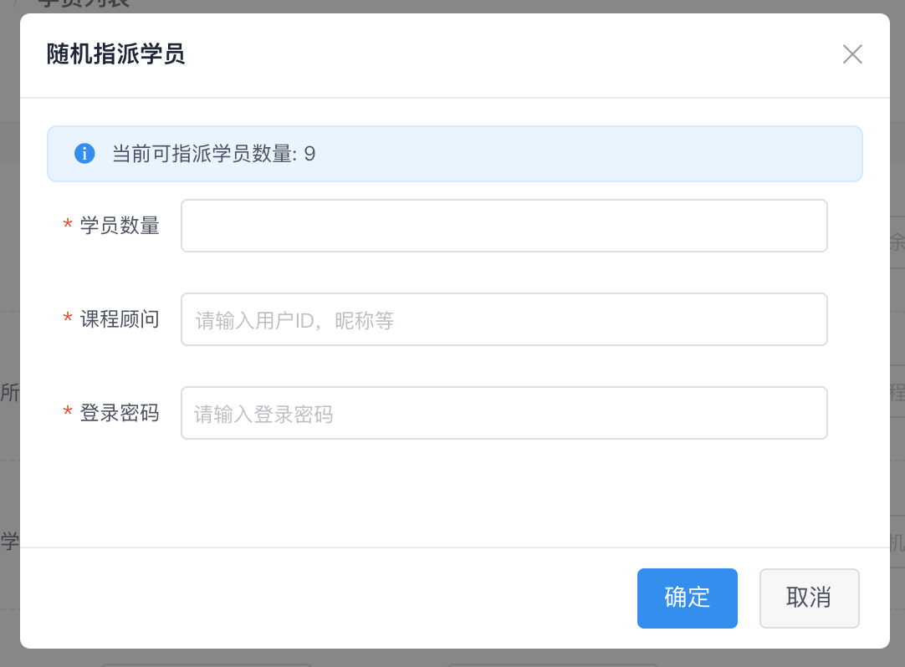

> 最近开始接触 vue 和 iview。这次将最近使用的经验总结给大家，希望对刚接触 iview 的开发者有一定的帮助。

## 什么是 iview

iview 是基于 vue 开发的主题框架。其设计理念来源于 [Ant Design](https://ant.design/)。可以算是 Vue 中的 Ant Design。项目主要是由开发者 [icarusion](https://github.com/icarusion) 进行维护。

## iview 介绍

### 组件

在 iview 中，一些组件需要同时出现才能起作用：

- `<Select>`和`<Option>`
- `<Tabs>`和`<TanPane>`
- `<Form>`和`<FormItem>`
- `<Collapse>`和`<Pane>`
- `<Timeline>`和`<TimelineItem>`
- `<Menu>`和`<MenuItem>`,`<Submenu>`
- `<DropdownMenu>`和`<DropdownItem>`
- `<Breadcrumb>`和`<BreadcrumbItem>`
- `<Steps>`和`<Step>`

一些组件成对出现会影响样式和效果等：

- `<ButtonGroup>`和`<Button>`
- `<RadioGroup>`和`<Radio>`
- `<CheckboxGroup>`和`<CheckBox>`

一些组件是通过方法调用的：

- `$Message`
- `$Notice`
- `$Modal`或`<Modal>`
- `$Loading`

### 事件

iview 组件暴露的事件，都是以`on-`开头的，比方`<Select>`组件的`on-change`等。

这些事件，你都可以在官方文档对应组件文档最下面找到。

所以代码中事件需要写成：

```html
<Select @on-change="() => {}"></Select>
```

### 自定义表单组件

`iview`本身只提供了一些常用的表单组件：`<Input>`，`<Radio>`，`<Select>`等。有时候，我们需要使用封装了业务逻辑的表单。

在学习 vue 时，我们都知道自定义组件的`v-model`的实现方式是，通过`value`和`input`事件实现（可以自定义）。

```javascript
// https://github.com/iview/iview/blob/2.0/src/mixins/emitter.js
import Emitter from 'Emitter'

export default {
  name: 'custom-component',
  
  mixins: [ Emitter ],
  
  props: {
    // value
    value: String,
  },
  
  data() {
    return {}
  },
  
  methods: {
    _onChange(val) {
      // v-model
      this.$emit('input', val)
      // 符合 iview 自定义事件
      this.$emit('on-change', val)
      // 自定义 iview 表单组件 必写该行
      this.dispatch('FormItem', 'on-form-change', this.val)
    },
  }
}
```

上面的`this.dispatch('FormItem', 'on-form-change', this.val)`可能会让你感到困惑，不过没关系，下一节将会让你弄明白。

## iview 组件实现揭秘

为了更好的理解该节，我们以`<Form>`和`<FormItem>`为例来解密组件间的通信：

```html
<!-- template -->
<Form ref="form" :model="formModel">
  <FormItem prop="user" :rules="userRules">
    <Input type="text" v-model="formModel.user" placeholder="Username">
    </Input>
  </FormItem>
  <FormItem prop="pass" :rules="passRules">
    <Input type="password" v-model="formModel.pass" placeholder="Password">
    </Input>
  </FormItem>
  <FormItem>
    <Button type="primary" @click="handleSubmit">SUBMIT</Button>
  </FormItem>
</Form>
```

```javascript
// javascript
export default {
  data() {
    return {
      formModel: {},
      userRules: { required: true, message: 'Username cannot be empty' },
      passRules: { required: true, message: 'Password cannot be empty' },
    }
  },
  
  methods: {
    handleSubmit() {
      this.$refs.validate(valid => {
        if (!valid) return this.$Message.error('Not valid')
        
        // console. the result
        console.dir(this.formModel)
      })
    },
  },
}
```

上面是一个简单的表单示例。当你未输入用户名密码，点击`SUBMIT`按钮时，你会看到在对应输入框下会显示出错误提示。

然而在`handleSubmit`中，我们只调用了`<Form>`组件的`validate`方法。在`<Form>`组件中，`validate`方法调用了`<FormItem>`组件中的`validate`方法。

这里就有一个疑问了：为什么`<Form>`中可以调用到`<FormItem>`中的`validate`方法呢？

有些人可能说，这很简单，我们可以在`<Form>`里向下遍历子节点，搜集所有的`<FormItem>`节点。

这样确实可以，但是很麻烦。`<Form>`下的`<FormItem>`所属层级可能各不相同，从而造成很难遍历完整，且性能低下，如下图：


在`<Form>`组件内部并不是这样的。

```javascript
// Form
// https://github.com/iview/iview/blob/2.0/src/components/form/form.vue
export default {
  name: 'iForm',

  provide() {
    return { form : this };
  },

  data() {
    return {
      fields: [],
    }
  },
  
  // created
  created() {
    this.$on('on-form-item-add', field => {
      if (field) this.fields.push(field)
      
      return false
    })
    
    this.$on('on-form-item-remove', field => {
      if (field.prop) this.fields.splice(this.fields.indexOf(field), 1)
      
      return false
    })
  },
  
  methods: {
    validate(callback) {
      return new Promise(resolve => {
        /* some code */
        
        this.fields.forEach(field => {
          // call the validate method of <FormItem>
          field.validate()
        })
      })
    }
  },
}
```

在`<Form>`组件创建完毕时，监听了两个事件：`on-form-item-add`用于收集`<FormItem>`对象，从而在后面调用其`validate`方法进行表单验证；`on-form-item-remove`用于移除无用的`<FormItem>`对象。

`<FormItem>`相对较为复杂一点，我将核心代码进行了简化：

```javascript
// https://github.com/iview/iview/blob/2.0/src/mixins/emitter.js
import Emitter from 'Emitter'

export default {
  name: 'FormItem',
    
  mixins: [Emitter],
    
  inject: ['form'],
  
  mounted() {
    this.dispatch('iForm', 'on-form-item-add', this)
  },
  
  beforeDestroy() {
    this.dispatch('iForm', 'on-form-item-remove', this)
  },
  
  methods: {
    validate() {
      // some code
    },
  },
}
```

要理解上面的代码，需要先理解`Emitter`这个 mixin。

```javascript
// https://github.com/iview/iview/blob/2.0/src/mixins/emitter.js

function broadcast(componentName, eventName, params) {
  this.$children.forEach(child => {
    const name = child.$options.name

    if (name === componentName) {
      child.$emit.apply(child, [eventName].concat(params))
    } else {
      // todo 如果 params 是空数组，接收到的会是 undefined
      broadcast.apply(child, [componentName, eventName].concat([params]))
    }
  })
}
export default {
  methods: {
    // 触发父组件监听的一个事件
    dispatch(componentName, eventName, params) {
      let parent = this.$parent || this.$root;
      let name = parent.$options.name;

      while (parent && (!name || name !== componentName)) {
        parent = parent.$parent;

        if (parent) {
          name = parent.$options.name;
        }
      }
      if (parent) {
        parent.$emit.apply(parent, [eventName].concat(params));
      }
    },
    // 触发子组件监听的一个事件
    broadcast(componentName, eventName, params) {
      broadcast.call(this, componentName, eventName, params);
    }
  }
}
```

`dispatch(componentName, eventName, params)`用于触发当前组件父组件`<componentName>`的`eventName`事件，并传参`params`。

`broadcast(componetName, eventName, params)`用于触发当前组件子组件`<componentName>`的`eventName`事件，并传参`params`。

现在是不是理解了 iview 组件之间的通信方式？很简单对吧！？

在前面，我提到了创建自定义组件时，需要加上一段`this.dispatch('FormItem', 'on-form-change', this.val)`。其实，在`<FormItem>`组件中，就监听了这个事件，在事件监听的回调里，会进行表单的校验。所以，我们需要每次值变化通知`<FormItem>`，从而造成表单的校验。

## 在 iview 基础之上封装自己的业务组件

iView 很像 Ant Design。Ant Design 有一个著名的项目——[Ant Design Pro](https://pro.ant.design/index-cn)，基于 Ant Design 封装了一系列高级组件。

为了让开发更为高效和便捷，我也根据`Ant Design Pro`仿写了一系列的 vue 版本组件。


下面我对一些组件进行简单说明。

### pl-media

`pl-media` 是自定义的一个组件，用于监听页面的响应式，从而控制展示样式。其核心代码抽离为了一个项目：[vue-media-query](https://github.com/blackcater/vue-media-query)。

### pl-loader

`pl-loader` 是实现区域内容加载。核心代码来源于开源项目：[vue-content-loader](https://github.com/egoist/vue-content-loader)

### pl-form

表单是运营后台开发中最常用的组件之一，`pl-form`是所有自定义组件中的核心组件之一，许多组件都是在`pl-form`基础之上封装而成，或者与`pl-form`有关联。

iview 在实现表单数据收集，十分的复杂。提升表单收集效率，我们在`<Form>`和`<FormItem>`之上封装了一层。只需要简单的配置，就会自动的渲染出一个表单。

```html
<!-- template -->
<pl-form :fields="fields" :fetch="login"></pl-form>
```

```javascript
// javascript
import Emitter from 'Emitter'
import { Input } from 'iview'

const MyOwnPassword = {
  props: {
    value: String
  },
  
  mixins: [Emitter],
    
  render() {
    return (
      <Input
        value={this.value}
        {...this.$attrs}
        on-on-change={this._onChange}
      ></Input>
    )
  },
  
  methods: {
    _onChange(val) {
      this.$emit('input', val)
      this.$emit('on-change', val)
      this.dispatch('FormItem', 'on-form-change', val)
    }
  }
}

export default {
  data() {
    return {
      fields: [
        {
          name: 'username',
          type: 'Input',
          label: '用户名',
          props: { placeholder: '请输入用户名' },
          rules: { required: true, message: '用户名不能为空' },
        },
        {
          name: 'password',
          label: '密码',
          component: MyOwnPassword,
          props: { placeholder: '请输入用户名' },
          rules: { required: true, message: '用户名不能为空' },
        },
      ],
    }
  },
  
  methods: {
    // 登录请求
    login(data) {
      // data 为由 pl-form 收集到的数据
      
      // $http 为 vue-resource 实例，你也可以使用其他请求库
      this.$http.post('/oauth2', data)
        .then(() => this.$Message.success('登录成功'))
        .then(() => this.$Message.error('登录失败'))
    },
  },
}
```

上面就是`pl-form`的简单使用示例。既支持iview原生实现的组件，通过`type`指定；也可以支持自定义表单组件，通过`component`指定。





上面示例的实现，都是基于`pl-form`实现的。

## 总结

iview 很不错，但是实际使用中问题也较多。毕竟该项目不是大企业专门团队在维护。虽然坑多，但不影响其成为一个不错的选择。

你在怀疑我这句话？不妨看看官方的例子[iview-admin](https://github.com/iview/iview-admin)。
