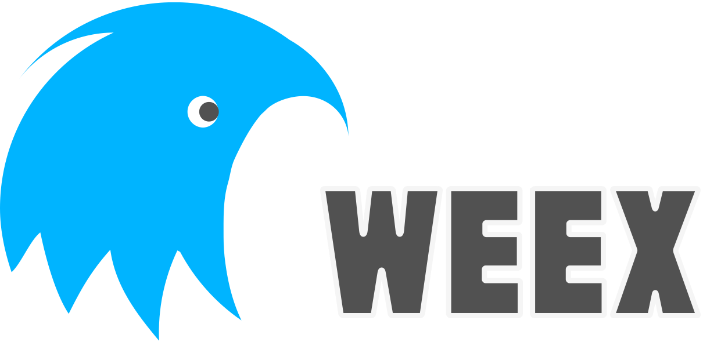
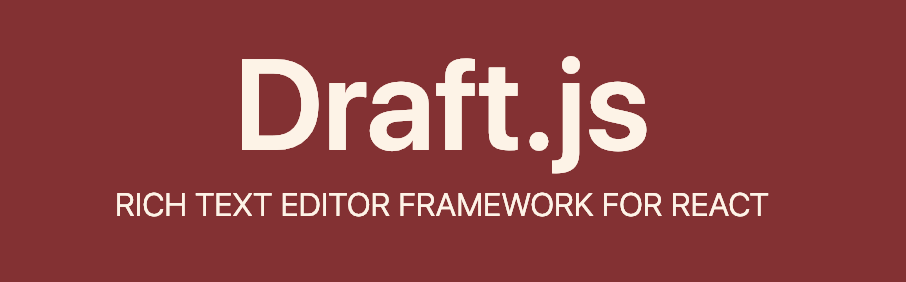
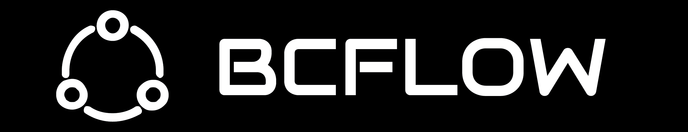

又到了一年一度的总结时间，已经大半年没有更新过博客了。今年的这片文章感觉比去年写年度总结的时候难了许多。感觉自己的成长速度已经开始变得缓慢了，也说明我去年有所松懈。

## 2018 年总结

### 工作

#### vue.js

2018 年我接触最多的前端框架是 `Vue`。公司今年有了新产品线，我被分到了新产品线，新产品线的运营后台是基于 `Vue` 开发的，十分大型的管理系统。原先的系统功能较少，因此开发中并不需要特别规范，个个页面书写各不相同。因此，为了提高开发效率，规范页面开发，整个项目的结构被我重构了。

#### weex

今年接触了 `weex`，写 demo 的时候感觉真心不错，然而用于实际开发时，并不能做到期声明的 `Write once, run everywhere.`。对于十分简单的页面，可能没问题，但一稍微复杂一点，就会导致各种 iOS 上可行，Android 上不行的头疼问题。

为了上 `weex` ，我们还专门与服务端一起开发了静态资源版本管理逻辑，感觉最后投入和产出差距太多

还有就是开发时十分的让我头疼，`weex` 官方文档感觉是上古的东西，很多都没写全，得去翻源码？What？真的很费时费力。

我们为了提高效率，直接是用的 `rax` 进行的开发，`rax` 的 DSL  和 `react native` 很像。然而开发中也是遇到了各种问题，也得去翻阅源码。

最后，虽然上线了，但感觉真的没有 H5 好，只要使用 HTTP/2 + PWA + 服务端渲染，期体验真不比 `weex` 和 `react native` 这种技术差。

#### draft.js

富文本编辑器是我刚接触 `react` 用于实践开发的第一个项目。框架用的是 `draft.js`。

随着公司帖子承载的内容的形式越来越重要，所以需要丰富帖子内容的展示形式，然而当时的富文本编辑器是 `flux` 开发的，功能上耦合有点眼中，且开发时多文件切换十分影响开发效率。

因此，这次使用 `draft-js-plugins-editor` 进行了重构，一个功能是一个插件，个个插件完全相互独立，这使得功能移植十分方便。

#### 零配置开发工具

一说到零配置开发工具，大家就会想到 `create-react-app` 或者 `vue-cli`，没错它们都是十分不错且强大的工具。但是它们太过于灵活，我们想要工具中直接包含 `eslint + prettier` 进行代码规范校验，包含 `husky + commitlint` 进行提交规范校验，以及包括 `gitlab ci` 部署流程逻辑。有了这些耦合，可以让我们的开发更加轻松。

这个工具是我单独一个人开发的，现在依旧在 `alpha` 版本，还不稳定，已在一些项目中被应用，也接入支持 `electron` 项目。

### 开源

开源是我 2018 年投入较多的一部分。相比 2017 年多了很多，但和其他开源大神相比，相距很远。

#### easy-mock

第一次在社区中看到大搜车的 `easy-mock` 项目，感觉非常的不错，因此就封装成 `docker` 镜像供大家使用，而且还在公司内部推广，虽然最后没有内部大范围使用，但不需这次的体验。

#### verdaccio

`verdaccio` 是想搭建私有 `npm` 镜像库的时候发现的一个开源项目，十分的强大和给力。为这个项目专门写了 `docker` 镜像。后来官方出了 `docker` 镜像，因此这个镜像只在内部使用。

#### bcflow

由于 2018 年，灵感激发，想写很多项目，然而每个项目不论是应用还是库，都得写一堆配置文件 `webpack`，`rollup`，`prettier`，`eslint`，`husky` 等。真心浪费时间。所以想开发一个构建工具，可以支持我以后所有会开发的类型项目。

起初想到了 `yeoman` ，自己开发一些模板不久行了么？然而，项目模板中会包含这些配置文件，如果第三方依赖升级，模板也得升级，项目就得迁移到新项目，十分的浪费经历，因此需要是零配置的工具。

所以，`bcflow` 重写了很多次，最后还没想好这个项目的架构是什么样的，怎么使用的，怎么扩展的等等。

#### vsuite

一直想开发一个类似于 `ant-design` 的类库，一天发现了 `rsuite`，项目也包含设计稿，因此就准备开发一个 `vue` 版本的，最后叫做了 `vsuite`，该项目基本来说所有的组件都开发完了，只差 `table` 组件。

但是开发到最后，因为年底迭代多问题就放了很久。而且，`vue` 要大版本更新了，我也很想用 `typescript` 重写一边，我怕我写了之后，会使得后续重写很费时间，因此就没在继续开发了。

## 2019 年计划
