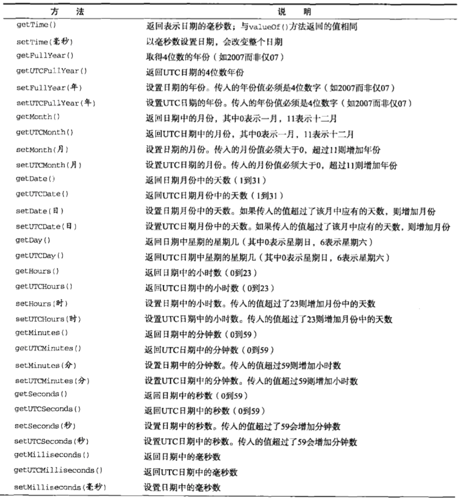

## 引用类型

[TOC]

## Array

### 基本操作

```javascript
var arr = new Array(3); // 长度为3空数组
var arr = new Array('1', '2'); // 长度为2且值为'1'和'2'
var arr = []; // 字面量形式
var arr = ['1', '2']; 

arr.length; // 获取数组长度
arr instanceof Array; // 数组检测
Array.isArray(arr); // 数组检测
```

### 转换方法

所有对象都具有`toLocalString(), toString(), valueOf()`方法。

调用`toString()`方法会返回由数组中每个值得字符串形式拼接而成的以逗号分隔开的字符串。

调用`valueOf()`返回的还是数组。

调用`toLocalString()`方法与调用`toString()`形式很像，都是用`,`隔开多个值，只是`toLocalString()`调用的是数组每个值的`toLocalString()`方法。而`toString()`调用的是每个值的`toString()`方法。

如果数组中某一项值为null或undefined，那么该值在`join()`, `toLocalString()`, `toString()`, `valueOf()`方法返回的结果中以空字符窜表示。

### 栈方法和队列方法

`push`方法返回的是数组长度

`unshift`方法返回的是数组长度

`pop`方法返回的是获得的值

`shift`方法返回的是获得的值

### 操作方法

`sort`排序

`slice`截取

`splice`功能强大的截取

- 删除 ： `splice(0, 2)` 删除0位开始2项
- 插入 ： `splice(2, 0, 'red', 'green')` 在2位插入`'red'`和`'green'`
- 替换 ： `splice(2, 1, 'red', 'green'` 在2位删除1一个，插入2个。

`index`某个值位置

`lastIndexOf`某个值最后一次出现位置

### 迭代方法

`every()` 对数组中每一项运行一个函数，如果每一项都返回true就返回true

`some()` 对数组每一项运行一个函数，如果有一项返回true就返回true

`filter()` 对数组每一项运行一个函数， 返回该函数返回true的项组成的数组

`map()` 对数组每一项运行一个函数，返回每次函数调用的结果组成的数组

`forEach()` 对数组中每一项运行一个函数。没有返回值。

### 缩小方法

`reduce` 和 `reduceRight`


## Date

### 基本用法

```javascript
// Date有2个方法：Date.parse 和 Date.UTC
/*
满足 ： '月/日/年'
	   '英文名月 日, 年'
	   '英文星期 英文月 日 年 时:分:秒: 时区'
	   ISO扩展格式'YYYY-MM-DDTHH:mm:ss'
可以被Date.parse()解析成毫秒数，被new Date()解析成正真的Date对象
*/

// Date.now() 获取当前时间的Date对象。

// date.toString()
// date.toLocalString()
```

## 日期格式化方式

`toDateString()`

`toTimeString()`

`toLocaleDateString()`

`toLocaleTimeString()`

`toUTCString()`




### RegExp

```javascript
var reg = /pattern/gim
var reg = new RegExp("pattern", "gim");
var reg = new RegExp(/pattern/, "gim");
// 上述三种方式是登等价的，都是用于创建RegExp对象。
```

每个正则表达式都可带一个或多个标志

- g : 表示全局模式，模式将被应用到所有字符串，而非发现第一个匹配项时立即停止
- i ：表示不区分大小写模式。
- m : 表示多行模式，即在到达一行文本末尾时还会继续查找下一行是否有与模式匹配的项。

### 实例属性

- global : 布尔值，表示是否设置了g标志
- ignoreCase : 布尔值，表示是否设置了i标志
- lastIndex : 整数，表示开始搜索下一个匹配的字符位置，从0算起。
- multiline : 布尔值，表示是否设置了m表示
- source : 正则表达式的字符串表示，按照字面量形式而非传入构造函数中的字符串模式返回。

### 实例方法

- exec()

  接受一个参数，需要应用模式的字符串。然后返回包含第一个匹配项信息的数组；或则在没有匹配项的情况下返回null。虽然返回的数组依然是Array的实例，但是包含两个额外的属性：`index`和`input`。`index`表示匹配项在字符串中的位置，`input`表示应用正则表达式的字符串。在数组中，第一项是与整个模式匹配的字符串，其他项是与模式中的捕获组匹配的字符串(如果模式没有匹配组，那么该数组就只包含一项)。例如:

  ```javascript
  var reg = /a{1,3}(bbb(cc)?)(d|e)/;
  var result = reg.exec("fgaaabbbe");
  // ["aaabbbe", "bbb", undefined, "e"]
  result.input // "fgaaabbbe"
  result.index // 2

  // 对exec()方法而言，即使在模式中使用了全局标志，它每次也只会返回一个匹配项。在不设置全局标志下，在同一个字符串上多次调用exec()将始终返回第一个匹配项信息。而在设置全局标志的情况下，每次调用exec()都会在字符串中继续查找匹配项。

  var text = "cat bat";
  var pattern1 = /.at/;
  var pattern2 = /.at/g;

  var matches = pattern1.exec(text);
  matches[0]; // cat
  matches = pattern1.exec(text);
  matches[0]; // cat

  matches = pattern2.exec(text);
  matches[0]; // cat
  matches = pattern2.exec(text);
  matches[0]; // bat
  matches = pattern2.exec(text);
  matches; // null
  ```

### RegExp构造函数属性

RegExp构造函数包含一些属性。这些属性适用于作用域中所有正则表达式，并且基于所执行的最近一次正则表达式操作而变化。

|     属性名      |                说明                |
| :----------: | :------------------------------: |
|    input     |       最近一次要匹配的字符串。Opera没有        |
|  lastMatch   |         最近一次的匹配项。Opera没有         |
|  lastParen   |        最近一次匹配的捕获组。Opera没有        |
| leftContext  |     input字符串中lastMatch之前的文本      |
|  multiline   | 布尔值，表示是否所有表达式都使用多行模式。IE, Opera没有 |
| rightContext |     input字符串中lastMatch之后的文本      |

```javascript
var text = "this has been a short summer.";
var pattern = /(.)hort/;
RegExp.input;
RegExp.lastMatch;
RegExp.lastParen;
RegExp.leftContext;
RegExp.rightContext;
RegExp.multiline;
```

除了上面介绍了几个属性，还有多达9个用于存储捕获组的构造函数属性。访问这些属性的方法为`RegExp.$_(_为1-9数值)`


## Function

### 函数内部属性

函数内部有两个特殊的对象：`arguments`和`this`。`arguments`对象又一个叫`callee`的属性，该属性是一个指针，指向拥有这个arguments对象的函数。

`function.caller`保存着调用当前函数`function`的函数的引用。

```javascript
function outter (){
  inner();
}
function inner (){
  alert(arguments.callee.caller); // outter
}
```

`function.length`保存着该函数`function`希望接受的参数个数


## 基本包装类型

为了便于操作基本类型值，ECMAScript提供了 3个特殊的引用类型：Boolean, Number, String。这些类型与本章介绍的其他引用类型相似，但同时也具有与各自的基本类型相应的特殊行为。实际上，每当读取一个基本类型值，后台就会创建一个对应的基本包装类型的对象，从而让我们调用一些方法来操作数据。

后台自动完成了下列处理：

- 创建基本类型的一个实例

- 调用基本类型特定方法

- 销毁这个实例

  ```javascript
  var s1 = new String("some text");
  var s2 = s1.substring(0, 4);
  s1 = null;
  ```

引用类型与基本包装类型的主要区别就是对象的生存期。使用`new`操作符创建的引用类型的实例在执行流离开当前作用域之前都一直保持在内存中。而自动创建的基本包装类型的对象，只存在于一行代码执行的瞬间，然后立即销毁，这意味着，我们不能在运行时为基本类型值添加属性和方法。

### Boolean类型

基本类型与引用类型还是有个区别的。首先，`typeof`操作符对基本类型返回`boolean`对引用类型返回`object`。其次，由于`Boolean`对象是`Boolean`类型的实例，所以使用`instanceof`操作符测试`Boolean`对象会返回`true`，而测试基本类型的布尔值则返回`false`。

```javascript
var falseObj = new Boolean(false);
var result = falseObj && true; // true 对象一定是true

var falseValue = false;
var result = falseValue && true; // false

typeof falseObj; // object
tyepof falseValue; // boolean

falseObj instanceof Boolean; // true
falseValue instanceof Boolean; // false
```

### Number类型

`toFixed(num)`  num保留小数点的后多少位，四舍五入

`toExponential(num)` 科学计数法后，保留小数点num位

`toPrecision(num)`  显示数字的位数，位数太少，就调用`toExponential`，位数多调用`toFixed`

### String类型

`charAt(index)` 返回指定位置处的字符

`charCodeAt(index)` 返回指定位置处的字符串编码

`substring(from, to)`

`substr(from, length)`

`slice(from, to)`

`indexOf(str)`

`lastIndexOf(str)`

`toLocaleUpperCase(), toUpperCase()`

`toLocaleLowerCase(), toLowerCase()`

`search(/pattern/)` 返回满足模式的位置

`replace(/pattern/, str)` 将满足模式的字符串用str替换

- 第二个参数字符串还可以用一些特殊的字符序列

  | 字符序列 |                 替换文本                 |
  | :--: | :----------------------------------: |
  |  $$  |                  $                   |
  |  $&  |   匹配整个模式的字符串。与RegExp.lastMatch值相同    |
  |  $'  | 匹配的子字符串之前的子字符串。与RegExp.leftContext相同 |
  |  $`  | 匹配的子字符串之后的字符串。与RegExp.rightContext相同 |
  |  $n  |        匹配第n个捕获组的字符串，其中n等于0-9。        |
  | $nn  |            匹配第nn个捕获组的字符串             |

- 第二个参数还可以是函数。函数有3个参数：模式的匹配项，模式匹配项在字符串中的位置和原始字符串。

`split` 分割字符串

```javascript
var colorText = "red, green, blue";
var color1 = colorText.split(", ") // ["red", "green", "blue"]
var color2 = colorText.split(", ", 2) // ["red", "green"]
var color3 = colorText.split(/.\s*/) // ["red", "green", "blue"]
```

`localeCompare()`方法用于比较两个字符串大小。

`fromCharCode(code...)` 将一系列code值转化为字符串。 


## 单体内置对象

Global全局对象可以说是ECMAScript中最特别的一个对象了，不管你从什么角度看，这个对象都是不存在的。ECMAScript中的Global对象在某种意义上是作为一个终极的“兜底儿对象”，不属于任何其他对象的属性和方法都属于这个对象。

### URI编码方式

Global对象的`encodeURI`和`encodeURIComponent`方法可以对URI进行编码。有效的URI中不能包含某些字符，例如不能包含空格。

其中`encodeURI()`主要对整个URI进行编码，但是不会编码本省属于URI的特殊字符，例如 `:`, `/`, `?`, `#`。

而`encodeURIComponent()`会对它发现的任何非标准字符进行编码

与这两个方法对应的是`decodeURI`和`decodeURIComponent`

### eval()

在`eval()`中创建的任何变量或函数都不会被提升，因为在解析代码的时候，他们被包含在一个字符串中，他们只是在`eval()`执行的时候创建。

严格模式下，外部访问不到`eval()`中创建的任何变量或函数。同样，在严格模式下，为eval赋值也会导致错误

### Global对象的属性

下表为Global对象的所有属性：

|    属性     |      说明      |       属性       |         说明         |
| :-------: | :----------: | :------------: | :----------------: |
| undefined | 特殊值undefined |      Date      |      构造函数Date      |
|    NaN    |    特殊值NaN    |     RegExp     |     构造函数RegExp     |
| Infinity  | 特殊值Infinity  |     Error      |     构造函数Error      |
|  Object   |  构造函数Object  |   EvalError    |   构造函数EvalError    |
|   Array   |  构造函数Array   |   RangeError   |   构造函数RangeError   |
| Function  | 构造函数Function | ReferenceError | 构造函数ReferenceError |
|  Boolean  | 构造函数Boolean  |  SyntaxError   |  构造函数SyntaxError   |
|  String   |  构造函数String  |   TypeError    |   构造函数TypeError    |
|  Number   |  构造函数Number  |    URIError    |    构造函数URIError    |

### window对象

ECMAScript虽然没有指出如何直接访问Global对象，但是Web浏览器都是将这个全局对象作为window对象的一部分加以实现的。

### Math对象

`min()`

`max()`

`random()`

`ceil()`

`round()`

`floor()`


