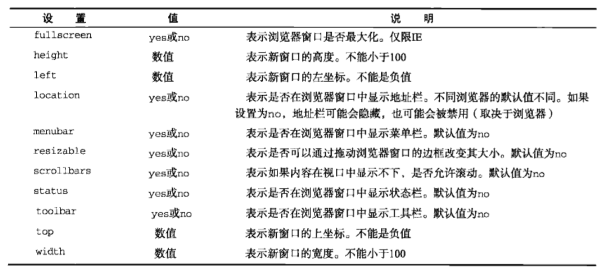
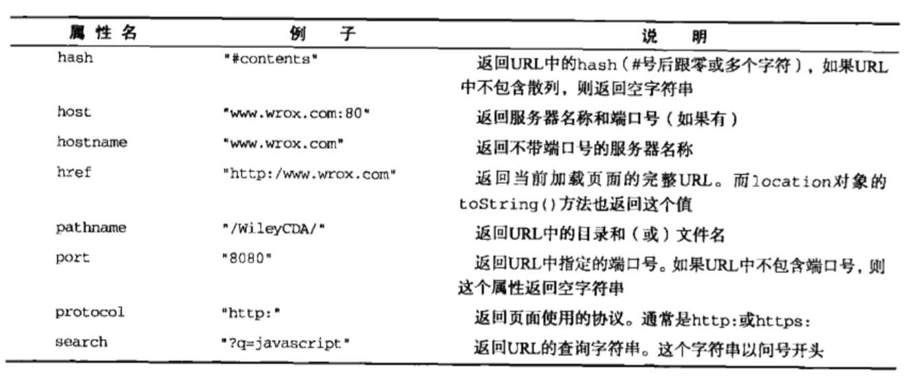

# BOM

[TOC]

## window对象

表示浏览器的一个实例。在浏览器中，`window`对象有双重作用，它既是通过JS访问浏览器窗口的一个接口，又是ECMAScript规定的Global对象。

### 全局变量与window属性

抛开全局变量会成为window对象的属性不谈，定义全局变量与在window对象上直接定义属性还是有一点差别的；全局变量不能通过delete进行删除，而直接在window对象上定义的属性可以删除。

```javascript
var age = 29;
window.color = 'pink';

delete age/window.age; // false 在IE < 9时抛出错误，其他浏览器返回false
delete color/window.color; // true 在IE < 9时抛出错误，其他浏览器返回true
```

尝试访问未声明的变量会抛出错误，但是通过查询window对象，可以知道某个可能未声明的变量是否存在。

```javascript
var newVal = oldVal; // ReferenceError

var newVal = window.oldVal; // undefined
```

### 窗口关系和框架

如果页面中包含框架，则每个框架都拥有自己的window对象，并用来保存在frames集合中。 在frames集合中，可以通过索引(从0开始，从左到右，从上到下)或者通过框架名称来访问相应的window对象。每个window对象都有一个name属性，其中包含框架的名称。

```html
<html>
<head>
    <title>Framework Example</title>
</head>
<body>
<frameset rows="160, *">
    <frame src="frame.html" name="topFrame" />
    <frameset cols="50%, 50%" >
        <frame src="oneFrame.html" name="leftFrame"/>
        <frame src="twoFrame.html" name="rightFrame"/>
    </frameset>
</frameset>
</body>
</html>

<!--
window.frames[0] 访问topFrame 需要在top中
window.frames["topFrame"] 访问topFrame 需要在top中
top.frames[0] 访问topFrame
top.frames["topFrame"] 访问topFrame
-->
```

与top相等的另一个window对象就是parent。parent指向直接上层框架，而top指向最上层框架。在某些情况下top可能等于parent。但是，在没有框架的情况下，parent一定等于top。

### 窗口位置

用于确定和修改window对象位置的属性和方法有很多。IE, Safari, Opera, Chrome都提供了`screenLeft`和`screenTop`属性，分别用于表示窗口相对于屏幕左边和上面的位置。Firefox则在`screenX`和`screenY`属性中提供相同的窗口位置信息。

```javascript
// 跨浏览器兼容
let left = (typeof window.screenLeft == 'number')?winodw.screenLeft:window.screenX;

let top = (typeof window.screenTop == 'number')?window.screenTop:window.screenY;
```

`moveTo()`, `moveBy()`可以用于移动窗口位置，但是这两个方法可能会被浏览器禁用

### 窗口大小

IE9+, Firefox, Safari, Chrome, Opera均提供了`innerWidth`, `innerHeight`, `outerWidth`, `outerHeight`四个属性。

在IE9+, Firefox, Safari中，`outerWidth`和`outerHeight`返回浏览器窗口本身尺寸。而`innerWidth`和`innterHeight`则表示该容器中页面视图区的大小。在chrome中，`outerWidth, outerHeight`与`innerWidth, innerHeight`值相同，都是视口大小而非浏览器大小。

在IE, Firefox, Safari, Opera, Chrome中，`document.documentElement.clientWidth`和`document.documentElement.clientHeight`中保存了页面视口的信息。在IE6中，这些属性必须在标准模式下才有效。如果混杂模式，就必须通过`document.body.clientWidth, document.body.clientHeight`获取相同的属性。而在混杂模式下的chrome，两种方式都能获取视口大小。

```javascript
// 兼容代码
var pageWidth = window.innerWidth
  , pageHeight = window.innerHeight;

if (typeof pageWidth == 'number'){
  if (document.compatMode == 'CSS1Compat') { // 判断是否处于标准模式
    pageWIdth = document.documentElement.clientWidth;
    pageHeight = document.documentElement.clientHeight
  } else {
    pageWidth = document.bodu.clientWidth;
    pageHeight = document.body.clientHeight;
  }
}
```

`resizeTo()`, `resizeBy()`可能被浏览器禁用

### 导航与打开窗口

`window.open(url, windowTarget, str, bool)`

```javascript
window.open('http://www.baidu.com/'); //打开页面

window.open('http://www.baidu.com/', 'topTarget'); // 第二个参数为已有窗口或者框架的名称，那么就会在具有该名称的窗口或框架中加载指定的URL
// 等同于<a href="http://www.baidu.com/" target="topTarget"></a>
```

此外，第二个参数也可以是下面任何一个特殊创建偶名称`_self`, `_blank`, `_top`, `_parent`。

默认情况下，没有第二个参数，就是在新标签页中打开url，且带有默认设置(工具栏，地址栏和状态栏等)。

- **弹出窗口**

  在不打开新窗口的情况下，会忽略第三个参数。

  第三个参数为逗号分隔开的字符串，表示在新窗口中显示哪些特性。可以设置的值如下：

  

  ```javascript
  var newWindow = window.open('http://www.baidu.com/', 'testWindow', 'height=400,width=400,left=10,top=10,resizable=yes');
  ```

  我们可以通过`newWindow`操作新窗口，调用`moveTo(), resizeTo()`之类的方法，可以调用`newWindow.close()`方法关闭新窗口。

  `window.closed`属性可以判断窗口是否被关闭。

  新创建的window对象有个`opener`属性，其中保存着打开它的原始窗口对象。这个属性只在弹出窗口中的最外层window对象(top)中有定义。

  有些浏览器(IE8和Chrome)会在独立的进程中运行每个标签页。当一个标签页打开另一个标签页时，如果两个window对象之间需要彼此通信，那么新标签页就不能运行在单独的进程中。在Chrome中，将新创建的标签页的opener属性设置为null，即表示在单独的进程中运行标签页。

  ```javascript
  var newWindow = window.open('http://www.baidu.com/', 'testWindow', 'height=400,width=400,left=10,top=10,resizable=yes');
  newWindow.opener = null;
  // 断开之后就没办法恢复
  ```

- **安全限制**

  各大浏览器厂商对打开新标签，是否能打开新标签，打开的新标签有哪些，没有哪些都有不一样的限定。

- **弹出窗口屏蔽程序**

  如果是系统屏蔽弹出窗口，则`window.open()`会返回null。

  如果是浏览器扩展或者其他程序阻止弹出窗口，那么`window.open()`会抛出错误。

  ```javascript
  let blocked = false;
  try {
    var newWin = window.open('http://www.baidi.com', '_blank');
    if (newWin === null) {
      blocked = true;
    }
  } catch (ex) {
    blocked = true;
  }

  if (blocked) {
    alert('The popup was blocked!');
  }
  ```

### 间歇调用和超时调用

`setTimeout()`, `setInterval()`

### 系统对话框

`alert()`, `confirm()`, `prompt()`


## location对象

location是最有用的BOM对象之一，它提供了与当前窗口中加载的文档有关的信息，还提供了一些导航功能。

location对象是很特别的一个对象，因为它既是window对象的属性，也是document对象的属性。即`document.location === window.location`。

location对象的用处不只是表现在它保存着当前文档的信息，还表现在它将URL解析为独立的片段。



### 查询字符串参数

```javascript
// 解析查询字符串
function getQueryStringArgs(){
  var qs = (location.search.length>0?location.search.substring(1):""),
      args = {},
      items = qs.length?qs.split("&"):[],
      item = null,
      name = null,
      value = null,
      len = items.length;
  for(i=0; i< len; i++) {
    item = items[i].split("=");
    name = decodeURLComponent(item[0]);
    value = decodeURLComponent(item[1]);
    if (name.length && (name.indexOf("[]") != -1)) {
       if (args[name]) {
         args[name].push(value);
       } else {
         args[name] = [];
         args[name].push(value);
       }
    } else if (name.length) {
      args[name] = value;
    }
  }
  
  return args;
}
```

