#异步IO

[TOC]

“异步”这个词语很早就诞生了，但是它大规模的流行却在web2.0浪潮中，它伴随着AJAX的第一个A席卷了web。

异步早就存在于操作系统的底层。在底层中，异步通过信号量，消息等方式有了广泛的应用。

异步I/O还有事件驱动以及单线程，它们构成了Node的基调。

与Node的事件驱动，异步I/O设计理念比较相近的一个知名产品为Nginx。Nginx采用纯C编写，性能表现非常优异。

##为什么要异步IO

关于异步IO为何在Node里如此重要，与其面向网络而设计不无关系。在跨网络的结构下，并发已经是现代编程中的标准配备了。具体可以从**用户体验**和**资源分配**说起。

###用户体验

异步的概念之所以首先在web2.0中火起来，是因为浏览器中JS在单线程中运行，与UI渲染公用一个线程。这意味着JS在执行时UI渲染和响应是处于停滞状态的。在B/S模型中，网络速度的限制给网页的实时体验造成了很大的麻烦。如果网页临时获取网络一个资源，通过同步方式获取，那么JS则需要等待资源完全从服务器端获取后才能继续执行，这期间US将停顿，不响应用户的交互行为。

为了让你们感知I/O开销的昂贵，如下表：

|  I/O类型  | 花费的CPU时钟周期 |
| :-----: | :--------: |
| CPU一级缓存 |     3      |
| CPU二级缓存 |     14     |
|   内存    |    250     |
|   硬盘    |  41000000  |
|   网络    | 240000000  |

###资源分配

假设业务场景中有一组互补相关的任务需要完成，现在主流方式有一下两种：

- 单线程串行执行
- 多线程并行执行

如果创建多线程的开销小于并行执行，那么多线程方式是首选。多线程的代价在与创建线程和执行期线程上下文切换的开销较大。另外在复杂的业务中，多线程编程经常面临锁和状态同步等问题，这是多线程被诟病的主要原因。但在多核CPU中能提升CPU利用率。

 操作系统会将CPU时间片分配给其余进程，以公平而有效的利用资源。基于这一点，有的服务器为了提升响应能力，会通过多个工作进行来为更多的用户服务。但是对于这一组任务而言，他们无法分发任务到多个进程上，所以依然无法 高效的利用资源，结束所有任务的事件会较长。

添加硬件资源是提升服务质量的一种方式，但不是唯一。

Node在两者间给出它的方案：单线程，异步I/O。

为了弥补单线程无法利用多核CPU的特点，Node提供了类似前端浏览器中Web Workers的子进程，该子进程可以通过工作进程高效地利用CPU和I/O。


##异步I/O实现现状

异步I/O在Node中应用广泛，但是并非其原创。下面我们看看操作系统对异步I/O实现的支持情况。

###异步I/O与非阻塞I/O

听到Node的介绍时，时常会听到**异步**, **非阻塞**, **回调**, **事件**这些词语混合在一起介绍出来，其中异步和非阻塞听起来是一回事。从实际效果来看，异步和非阻塞都达到了我们并行I/O的目的。但是从计算机内核I/O而言，异步/同步与阻塞/非阻塞实际是两回事。

操作系统内核对I/O只有两种方式：阻塞和非阻塞。调用阻塞过程如下所示：

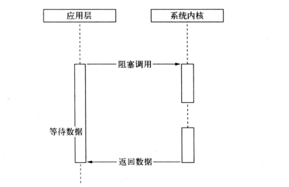

阻塞I/O的特点是调用之后一定要等到系统内核层面完成所有操作后，调用才结束。（以读取文件为例，系统内核在完成磁盘寻道，读取数据，复制数据到内存之后，这个调用过程才结束）

而非阻塞I/O如下所示：

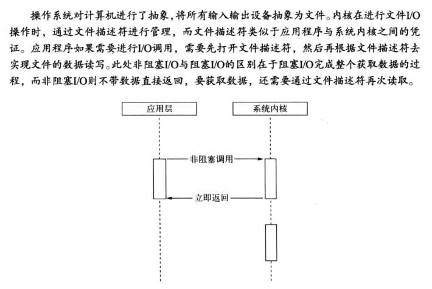

非阻塞I/O返回之后，CPU的时间片可以用来处理其他事务，此时性能提升是明显的。

但是非阻塞I/O也存在一些问题。由于完整的I/O并没有完成，立即返回的并不是业务的结果，而仅仅是当前调用状态。为了获取完整的数据，应用程序需要重复调用I/O操作来确定是否完成。这种重复调用判断操作是否完成的技术叫做**轮询**，接下来介绍这种技术。

阻塞造成CPU等待浪费，非阻塞需要轮询，会让CPU处理状态判断，是对CPU资源的浪费。下面介绍轮询技术的演进，看它是怎么减小I/O状态判断的CPU消耗的。

现在轮询技术主要有：

- **read**

  最原始，性能最低的一种，通过重复调用来检查I/O的状态来完成完整数据的读取。在得到最终数据前，CPU一直耗在等待上。

  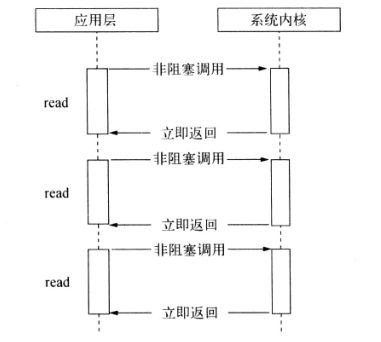

- **select**

  它是read的基础上的改进方案。通过对文件描述符上的事件状态来进行判断

  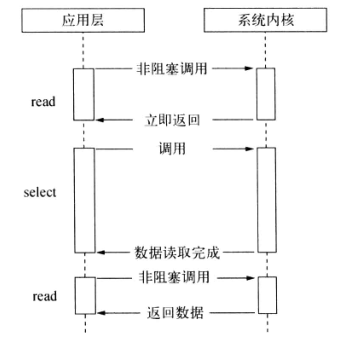

  select轮询具有一个较弱的限制，那就是它采用一个1024长度的数组来存储状态，所以它最多可以同时检查1024个文件描述符。

- **poll**

  该方案较select有改进，采用链表方式避免数组长度的限制，其次它能避免不需要的检查。但是当文件描述符较多时，它的性能还是十分低下的

  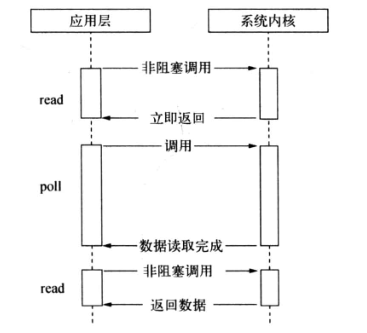

- **epoll**

  该方案是Linux下效率最高的I/O事件通知机制，在进入轮询的时候如果没有检查到I/O事件，将会进行休眠，直到事件发生将它唤醒。它真实利用了事件通知，执行回调的方式，而不是遍历查询，所以不会浪费CPU，执行效率较高。

  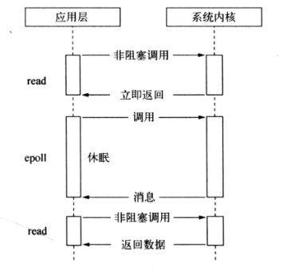

- **kqueue**

  该方案的实现方式与epoll类似，不过它仅在FreeBSD系统下存在。

轮询技术满足好非阻塞I/O确保获取完整数据的需求，但对应用程序而言，它仍然算一种同步，因为应用程序仍然需要等待I/O完全返回，依旧花费了很多时间来等待。等待期间，CPU要么用于遍历文件描述符的状态，要么处于休眠等待事件发生。

###理想的非阻塞异步I/O

尽管epoll已经利用了事件来降低CPU的消耗，但是休眠期间CPU几乎是闲置的，对当前线程而言利用率不够。

我们期望的完美的异步I/O应该是应用程序发起非阻塞调用，无需通过遍历或者事件唤醒等方式轮询，可以直接处理下一个任务，只需要在I/O完成后通过信号或回调函数将数据传递给应用程序即可。

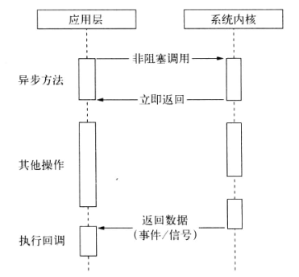

幸运的是，在Linux下存在这样一种方式，它原生提供的一种异步I/O方式(AIO)就是通过信号或回调来传递数据的。

但不幸的是，只有Linux下有，而且它还有缺陷(AIO仅支持内核I/O中的O_DIRECT方式读取，导致无法利用系统缓存)。

###现实的异步I/O

现实比理想要骨感一些，但是要达到异步I/O也并非难事。

前面我们将场景限定在单线程下，多线程的方式回事另一番风景。通过让部分的线程进行阻塞I/O或者非阻塞I/O加轮询技术来完成数据的获取。让一个线程进行计算，通过线程之间的通信将I/O得到的数据进行传递，这就轻松实现了异步I/O(尽管他是模拟的)。

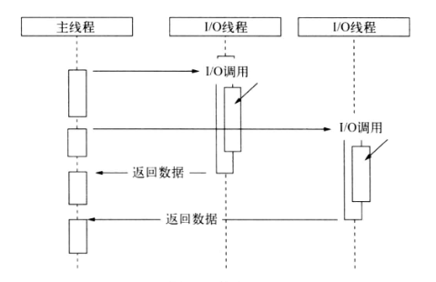

glibc的AIO便是典型的线程池模拟异步I/O。然而遗憾的是，它存在一些难以忍受的缺陷和bug，不推荐使用。libev的作者重新实现了异步I/O库：libeio。libeio实际上依然采用线程池与阻塞I/O模拟异步I/O。最初Node在*nix平台采用libeio配合libev实现I/O部分，实现了异步I/O。在Nodev0.9.3中，自行实现了线程池来完成异步I/O。

另一种异步I/O方案则是Windows下的IOCP，它在某种程度上提供了理想的异步I/O：调用异步方法，等待I/O完成之后的通知，执行回调，用户无需考虑轮询。但是其内部仍然是线程池的原理，不同之处在于这些线程池由系统内核接手管理。

IOCP的异步模型与Node的异步模型十分近似。所以Windows平台下采用了IOCP实现异步I/O。

由于Windows与*nix的区别，Node提供了libuv作为抽象封装层，使得所有平台兼容性的判断都由这一层来完成，并保证了上层的Node与下层的自定义线程池及IOCP之间各自独立。Node在编译期间会判断平台条件，选择性编译unix目录或是win目录下的源文件。

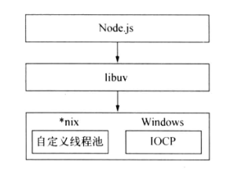

*注意：这里需要强调一点，这里的I/O并不仅仅局限于磁盘文件的读写，在\*nix系统中将计算机抽象了一番，磁盘文件，硬件，套接字等几乎所有计算机资源都被抽象为了文件，因此这里描述的阻塞和非阻塞的情况同样能够使用于套接字等*

*注意：另外需要强调的是，我们常提到的Node是单线程的，这里的单线程仅仅只是JS执行在单线程中罢了。在Node中，无论是\*nix还是windows平台，内部完成I/O任务的另有线程池*


##Node的异步I/O

介绍完系统对异步I/O支持后，我们继续介绍Nod是如何实现异步I/O的。这里我们除了介绍异步I/O的实现外，还将讨论Node的执行模型。完成整个异步I/O环节的有**事件循环**，**观察者**和**请求对象**等。


###事件循环

我们着重强调一下Node自身的执行模型——**事件循环**，正是它使得回调函数十分普遍。

在进程启动时，Node便会创建一个类似于`while(true)`的循环，每执行一次循环体的过程我们成为**Tick** 。每个Tick的过程中就是查看是否有事件待处理。如果有，就取出事件及其相关的回调函数。如果存在关联的回调函数，就执行他们。然后进入下个循环，如果不再有事件处理，就退出流程。

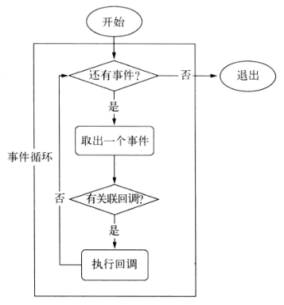


###观察者

在每个Tick过程中，如何判断是否有事件需要处理呢？这里需要引入新的概念**观察者** 。每个事件循环中有一个或多个观察者，而判断是否有事件要处理的过程就是向这些观察者询问是否有要处理的事件。一个观察者里可以有多个事件。

浏览器采用了类似的机制。事件可能来自用户的点击或者加载某些文件时产生，而这些产生的事件都有相应的观察者。在Node中，事件主要来源于网络请求，文件I/O等，这些事件对应的观察者有文件I/O观察者，网络I/O观察者等。观察者将事件进行了分类。

事件循环是一个典型的**生产者/消费者模型** 。异步I/O，网络请求等则是事件的生产者，源源不断为Node提供不同类型的事件，这些事件被传递到对应的观察者那里，事件循环则从观察者那里取出事件并处理。

在Windows下，这个循环基于IOCP创建；而在*nix下则基于多线程创建。


###请求对象

对于一般的(非异步)回调函数，函数由我们自行调用：

```javascript
var forEach = function(list, callback){
  for(var i = 0; i < list.length; i++){
  	callback(list[i], i, list);
  }
}
```

对于Node中的异步I/O调用而言，回调函数不由开发者调用。

那我们发出调用到回调函数被执行，中间发生了什么呢？

事实上，从JS发起调用到内核执行完I/O操作的过渡过程中，存在一种中间产物，叫做**请求对象**。

以`fs.open()`方法为例子

```javascript
fs.open = function(path, flags, mode, callback){
  // .....
  binding.open(path.Module._makeLang(path), stringToFlags(flags), mode, callback);
}
```

JS层面的代码通过调用C++核心模块进行下层的操作。

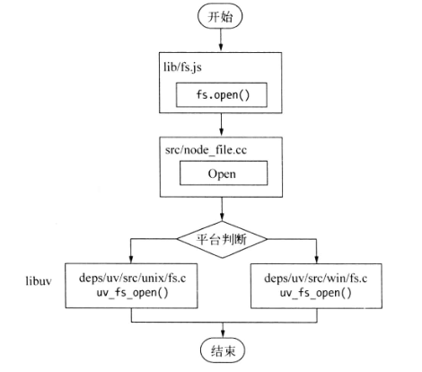

从JS调用Node核心模块，核心模块调用C++内建模块，内建模块通过libuv进行系统调用，这是Node里经典的调用方式。这里libuv是封装层，有两个平台的实现，其实调用的是`uv_fs_open()`方法。在`uv_fs_open()`的调用过程中，我们创建了一个FSReqWrap请求对象。从JS层传入参数和当前方法(指`uv_fs_open()`方法)都被封装到这个请求对象中，其中我们关心的回调函数被设置在这个对象的`oncomplete_sym`属性上：

```c
req_wrap->object_->Set(oncomplete_sym, callback)
```

对象包装完毕后，在Windows下，调用`QueueUserWorkItem()`方法将这个FSReqWrap对象推入线程池中等待执行。

```c
QueueUserWorkItem(&uv_fs_thread_proc, req, WT_EXECUTEDEFAULT)
// uv_fs_thread_proc: 将要执行的方法的引用，这里引用的是uv_fs_thread_proc
// req: 是uv_fs_thread_proc方法运行时需要的参数
// WT_EXECUTEDEFAULT: 是执行的标志。
```

当线程池中有可用的线程时，我们会调用`uv_fs_thread_proc()`方法。`uv_fs_thread_proc()`会根据传入参数的类型调用相应的底层函数。(以`uv_fs_open()`为例，实际调用的是`fs__open()`方法)。

至此JS调用立即返回，由JS层面发起的异步调用的第一阶段就此结束了。JS线程可以继续执行当前任务的后续操作。当前的I/O操作在线程池中等待执行，不管它是否阻塞I/O，都不会影响到JS线程的后续执行，如此就达到了异步的目的。

*请求对象是异步I/O过程中的重要产物，所有的状态都保存在这个对象中，包括送入线程池等待执行以及I/O操作完毕后的回调处理。*


###执行回调

组装请求对象，送入I/O线程池等待执行，实际上完成了异步I/O的第一部分，回调通知是第二部分。

线程池中的I/O操作调用完毕之后，会将获得的结果存储在req->result属性上，然后调用`PostQueuedCompletionStatus()`通知IOCP，告知当前对象操作已经完成：

```c
PostQueuedCompletionStatus((loop)->iocp, 0, 0, &((req)->overlapped))
```

该方法作用是向IOCP提交执行状态，并将线程归还给线程池。提交的状态可以通过`GetQueuedCompletionStatus()`提取。

在这个过程中，我们其实动用了事件循环的I/O观察者。在每次Tick的执行中，它会调用IOCP相关的`GetQueuedCompletionStatus()`方法检查线程池中是否有执行完的请求，如果存在会将请求对象加入到I/O观察者的队列中，然后将其当做事件处理。

I/O观察者回调函数的行为就是取出请求对象的`result`属性作为参数，取出`oncomplete_sym`属性作为方法，然后调用执行，以达到调用JS中传入的回调函数的目的。

至此，整个异步I/O流程完全结束，如下：

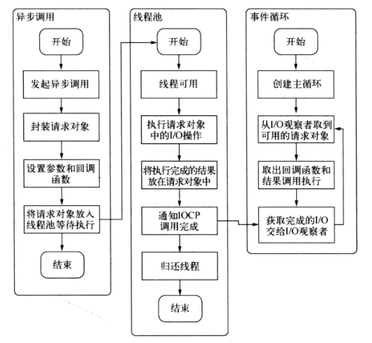

事件循环，观察者，请求对象，I/O线程池这四者共同构成了Node异步I/O模型的基本要素。

Windows下主要通过IOCP来向系统内核发送I/O调用和从内核获取已完成的I/O操作，配以事件循环，以此完成了异步I/O的过程。在Linux下，通过epoll实现这个过程，FreeBSD下通过kqueue实现，Solaris下通过Event ports实现。不同的是线程池在Windows下由内核（IOCP）直接提供，*nix系列下由libuv自行实现。


### 小结

从前面实现异步I/O的过程描述中，我们可以提取出异步I/O的几个关键字：单线程，事件循环，观察者，请求对象，回调执行和I/O线程池等等。这里单线程与I/O线程池看起来有点悖论。由于我们知道JS是单线程的，所以常识很容易理解为它不能充分利用多核CPU。事实上，在Node中，除了JS是单线程外，Node自身其实是多线程的，只是I/O线程使用CPU较少。另一个需要重视的观点则是，除了用户代码无法并行执行外，所有I/O(磁盘I/O，网络I/O等)则是可以并行起来的。


##非I/O的异步API

我们上面在介绍Node的时候，多数情况下都会提到异步I/O，但是，Node其实还存在一些与I/O无关的异步API，这一部分值得略微关注一下，它们分别是**setTimeout()**, **setInterval()**, **setImmediate()**, **process.nextTick()**。

###定时器

**setTimeout()**, **setInterval()**和浏览器API是一致的，分别用于单次或多次定时执行任务。它们的实现原理与异步I/O比较类似，只是不需要I/O线程池参与。调用`setTimeout()`或者`setInterval()`创建的定时器会被插入到定时器观察者内部的一个红黑树中。每次Tick时，都会从该红黑树中迭代取出定时器对象，检查是否超过定时时间，如果超过，就形成一个事件，它的回调函数将立即执行。

下图为`setTimeout()`的行为：

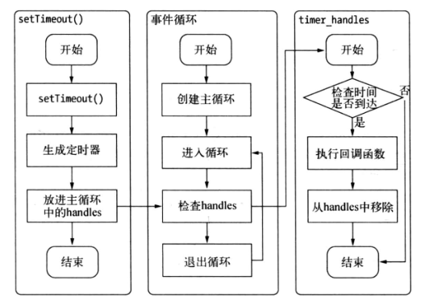

定时器的问题是在于，它并非精确的（在容忍的范围内）。尽管时间循环十分快，但是如果某一次循环占用的时间较多，那么下次循环时，也许已经超时很久了。


###process.nextTick()

在未了解`process.nextTick()`前，很多人为了立即执行某个人物，会这样调用setTimeout()来达到所需效果：

```javascript
setTimeout(function(){
  // TODO Something
}, 0);
```

由于事件循环自身特点，定时器的精确度不够。而事实上，采用定时器需要动用红黑树，创建定时器对象和迭代等操作，而setTimeout(fn, 0)的方式较为浪费性能。实际上，`process.nextTick()`方法的操作相对较为轻量：

```javascript
process.nextTick = function(callback){
  // on the way out, don't bother
  // it won't get fired anyway
  if (process._exiting) return;

  if (tickDepth >= process.maxTickDepth)
    maxTickWarn();

  var tock = {callback: callback};
  if (process.domain) tock.domain = process.domain;
  nextTickQueue.push(tock);
  if(nextTickQueue.length){
  	process._needTickCallback();
  }
}
```

每次调用process.nextTick()方法，只会将回调函数放入队列中，在下一次Tick中取出执行，定时器采用红黑树操作时间复杂度为O(lg(n))，nextTick()的事件复杂度为O(1)。


###setImmediate()

`setImmediate()`与`process.nextTick()`方法十分相似，都是将回调函数延迟执行。

但两者之间有细微差别。将它们方一起时，优先级又会怎样呢？

```javascript
setTimeout(function(){
  console.log("setTimeout");
}, 0);

setImmediate(function(){
  console.log("setImmediate");
});

process.nextTick(function(){
  console.log("process.nextTick");
});


console.log("continue!");

/*
result:
continue!
process.nextTick
setTimeout
setImmediate
*/
```

从结果看，process.nextTick()中回调函数的执行的优先级要高于setImmediate()。这里是因为在事件循环对观察者的检查是有先后顺序的，process.nextTick()属于idle观察者，setImmediate()属于check观察者。每一轮循环检查中，idle观察者先于I/O观察者，I/O观察者先于check观察者。

在具体实现中，`process.nextTick()`的回调函数保存在一个数组中，`setImmediate()`的结果这是保存在链表中。在行为上`process.nextTick()`会在每轮循环中将数组中的回调函数全部执行完。而`setImmediate()`在每轮循环中执行链表中的一个回调函数。


##事件驱动与高性能服务器

前面对异步实现原理的介绍，我们也基本勾勒出了事件驱动的实质，即：**通过主循环加事件触发的方式来运行程序** 。

Node在网络套接字的处理上，也用了异步I/O。网络套接字侦听到请求都会形成事件交给I/O观察者。事件循环会不停地处理这些网络的I/O事件。如果JS有传入回调函数，这些事件将会最终传递到业务逻辑层进行处理。下图是利用Node构建web服务器的流程图:

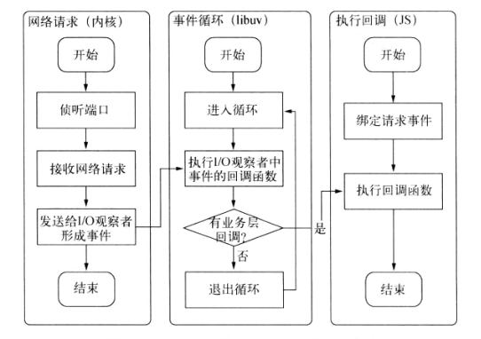

下面为几种经典的服务器模型，这里对比他们的优缺点。

- **同步式**

  对于同步式的服务，一次只能处理一个请求，并且其余请求都处于等待状态。

- **每进程/每请求**

  为每个请求启动一个进程，这样可以处理多个请求，但是它不具备扩展性，因为系统资源只有那么多。

- **每线程/每请求**

  为每个请求启动一个线程来处理。尽管线程比进程要轻量，但是由于每一个线程都占有一定内存，当大并发请求到来时，内存将很快用光，导致服务器缓慢。

**每线程/每请求**的扩展性比**每进程/每请求**好，但对于大型站点而言依然不够。

**每线程/每请求**目前还被Apache所采用。Node通过事件驱动的方式处理请求，无须为每个请求创建额外的应对线程，可以省掉创建线程和销毁线程的开销，同时操作系统在调度任务时因为线程较少，上下文切换的代价很低。这使得服务器能够有条不紊地处理请求，即使在大量连接的情况下，也不受线程上下文切换开销的影响，这是Node高性能的一个原因。

事件驱动带来的高效已经渐渐开始为业界所重视。知名服务器Nginx，也摒弃了多线程方式，采用了和Node相同的事件驱动。Node具有与Nginx相同的特性，不同之处在于Nginx采用纯C编写，性能较高，但是它仅适合于做web服务器，用于反向代理和负载均衡等服务，在处理具体业务方面较为欠缺。

事实上，Node的异步I/O并非原创，但确是第一个成功的平台。在之前，也有一些知名基于事件驱动的实现：

- Ruby的Event Machine
- Perl的AnyEvent
- Python的Twisted

在这些平台上采用事件驱动时，需要花一定精力了解这些库。这些库没有成功是因为同步I/O库的存在。本章描述的异步I/O实现，其主旨是使I/O操作与CPU操作分离。奈何这些语言平台上的标准I/O库都是阻塞式的，一旦事件循环中存在阻塞I/O，将导致其余I/O无法立即进行，性能急剧下降，其效果类似于同步式服务，其他请求将不能立即处理。