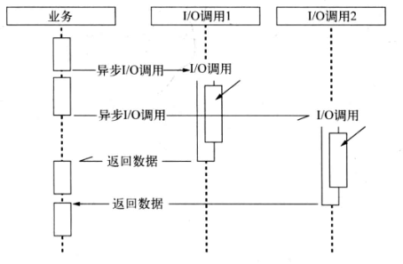
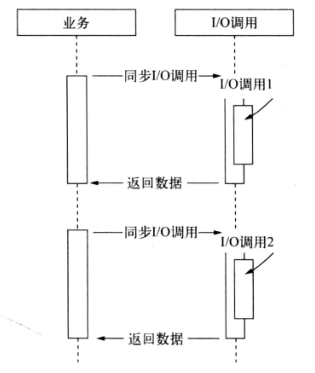
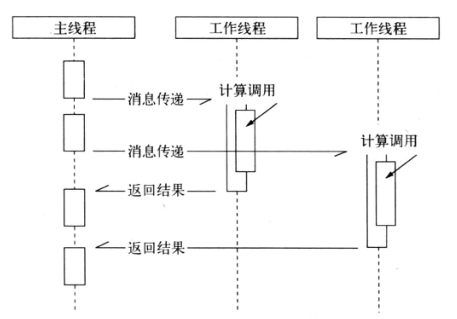
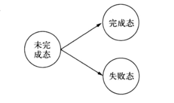
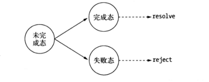
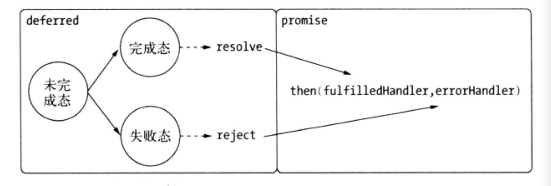
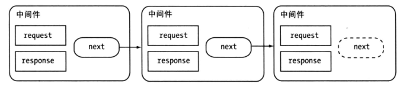

#异步编程

[TOC]

##函数式编程

###高阶函数

高阶函数就是把函数作为参数，或是将函数作为返回值的函数。

```javascript
function foo(x){
  return function(){
  	return x;
  }
}
```

高阶函数在JS中比比皆是，其中ES5中提供的一些数组方法（forEach, map, reduce, reduceRight, filter, every, some）。


###偏函数用法

偏函数用法是指创建一个调用另外一个部分——参数或变量已经预置的函数——的函数的用法。这句话拗口，我们看下面的例子：

```javascript
var toString = Object.prototype.toString;
var isString = function(obj){
  return toString.call(obj) === "[object String]";
};
var isFunction = function(obj){
  return toString.call(obj) === "[Object Function]";
};
```

在JS中进行类型判断，入过我们都按上面的格式进行书写，将会有很多的代码冗余。为了解决复用问题，我们引入一个新函数，这个新函数可以如工厂一样创建一些类似的函数。

```javascript
var isType = function(type){
  return function(obj){
  	return toString.call(obj) == "[object "+type+"]";	
  }
};
var isString = isType("String");
var isFunction = isFunction("Function");
```

上面这种通过指定部分参数来产生一个新的定制函数的形式就是**偏函数**

偏函数应用在异步编程中十分的常见。著名的underscore库的`after`函数就是偏函数。

```javascript
_.after = function(times, func){
  if (times <= 0) return func();
  return function(){
  	if (--times < 1) { return func.apply(this, arguments); }
  }
}
```


##异步编程的优势与难点

###优势

Node带来的最大特性莫过于基于事件驱动的非阻塞I/O模型，这是它的灵魂所在。非阻塞I/O可以使得CPU与I/O并不相互依赖等待，让资源得到更好的利用。对于网络应用而言，并行带来的想象空间更大，延展开来的是分布式和云。并行使得各个单点之间能够更有效的组织起来。



如果采用传统的同步I/O模型，分布式计算性能的折扣将会是明显的



利用事件循环的方式，JS线程像个分配任务和处理结果的大管家，I/O线程池里的线程都是小二，负责兢兢业业地完成任务，小二与管家之间互不依赖，所以可以保持整体的高效率。

这个模型缺点则在于管家无法承担过多的细节性任务，如果承担过多，则会影响到任务的调度，管家很忙，小二却很闲，结局则是整体效率的降低。

Node为了解决编程模型中阻塞I/O的性能问题，采用了单线程模型，这导致Node更像一个处理I/O密集问题的能手，而CPU密集型则取决于管家的能耐如何。

由于时间循环模型需要应对海量请求，海量请求同时作用在单线程上，就需要防止任何一个计算耗费过多的CPU时间片。至于是计算密集型还是I/O密集型，只要计算不影响异步I/O的调度，那就不构成问题。建议对CPU的消耗不要超过10ms，或者将大量的计算分解为诸多的小量计算，通过setImmediate进行调度。只要合理利用Node的异步模型和V8高性能，就可以充分的发挥CPU和I/O资源的优势。


###难点

#### 难点1：异常处理

过去处理异常

```java
try {
  // TODO
} catch (e) {
  // TODO
}
```

Node在处理异常上形成了一种约定，将异常作为回调函数的第一个实参传回，如果为空值，这表明异步调用没有异常抛出。

```javascript
async(function(err, callback){
  if(err){
  	// 有异常
  }
})
```

在异步编程中，另一个容易犯的错误是对用户传递的回调函数进行异常捕获，如下:

```javascript
try{
  req.body = JSON.parse(buf, optiosn.reviver);
  callback()；
}catch(err){
  err.body = buf;
  err.status = 400;
  callback(err);
}
```

上述代码，如果callback()出错，错误将被`try...catch...`代码块捕获，callback会被执行两次，这明显不符合业务逻辑。正确逻辑如下：

```javascript
try{
  req.body = JSON.parse(buf, optiosn.reviver);
}catch(err){
  err.body = buf;
  err.status = 400;
  callback(err);
}
callback();
```


#### 难点2：函数嵌套过深

例如遍历目录：

```javascript
fs.readdir(path.join(__dirname, ".."), function(err, files){
  files.forEach(function(filename, index){
  	fs.readFile(filename, "utf8", function(err, file){
      // TODO
	});
  });
});
```

对于上述场景，由于两次操作存在依赖，嵌套情有可原。那么，在网页渲染过程中，数据，模板，资源文件，三者之间并不存在依赖，但最终渲染结果中三者缺一不可。

```javascript
fs.readFile(template_path, "utf8", function(err, template){
  db.query(sql, function(err, data){
  	req.get(function(err, resources){
      // TODO
	});
  });
});
```


#### 难点3：阻塞代码

对于进入JS世界不久的开发者，比较纳闷的是为何没有`sleep`这种线程沉睡功能。唯独有的是`setTimeout()`，和`setInterval()`这两个函数，但是让人惊讶的是，他们并不会阻塞后续代码的执行。所以，多半程序员会用下面代码模拟sleep。

```javascript
var start = new Date();
while(new Date() - start < 1000){

}
```

但是事实是糟糕的，这段代码会继续占用CPU进行判断，与真正的线程沉睡相去甚远，完全破坏了事件循环的调度。由于Node单线程的原因，CPU资源全都会用于服务这段代码，导致其余任何请求都会得不到响应。


### 难点4：多线程编程

浏览器提出**Web Workers**，它通过将JS执行与UI渲染分离，可以很好的利用多核CPU为大量计算服务。同时前端Web Workers也是一个利用消息机制合理使用多核CPU的理想模型。下图为web workers工作示意图



遗憾在于前端浏览器存在对标准的滞后性，Web Workers并没有广泛的应用起来。另外Web Workers能够解决利用CPU和减小阻塞UI渲染，但是不能解决UI渲染效率问题。Node借鉴了这个模式，child_process是其基础API，cluster模块是更深层次的应用。


#### 难点5：异步转同步

习惯了异步编程的同学，也许能从容面对异步编程带来的副产品，比如嵌套回调， 够业务分散等问题。

## 异步编程解决方案

目前，异步编程解决方案有如下3中：

- 事件发布/订阅模式
- Promise/Deferred模式
- 流程控制库


###事件发布/订阅模式

事件监听器模式是一种广泛用于异步编程的模式，是回调函数的事件化，又称为发布/订阅模式

Node自身提供了events模块，是发布/订阅模式的一个简单实现，Node中部分模块都继承自它，这个模块比前段浏览器中的大量DOM事件简单，不存在事件冒泡，也不存在`preventDefault()`, `stopPropagation()`, `stopImmediatePropagation()`等控制事件传递的方法。它具有`addListener()`, `on()`, `once()`, `removeListener()`, `removeAllListener()`和`emit()`等基本的事件监听的方法实现。

事件发布/订阅模式自身并无同步和异步调用的问题，但在Node中，emit()调用多半是伴随事件循环而异步触发的，所以我们说事件发布/订阅广泛应用于异步编程。

事件发布/订阅模式常常用来解耦业务逻辑，事件发布者无须关注订阅的监听器如何实现业务逻辑，甚至不用关注有多少个侦听器存在，数据通过消息的方式可以很灵敏地传递。

在一些典型场景中，可以通过事件发布/订阅模式进行组件封装，将不变的部分封装在组件内部，将容易变化，需自定义的部分通过事件暴露给外部处理，这是一种典型的逻辑分离方式。

在这种事件发布/订阅式组件中，事件的设计非常的重要，因为它关乎外部调用组件时是否优雅，从某种角度来说事件的设计就是组件的接口设计。

从另一个角度看，事件侦听器模式也是一种**钩子(hook)**机制，利用钩子导出内部数据或状态给外部的调用者。Node中很多对象大多具有黑盒特点，功能点较少，如果不通过事件钩子的形式，我们就无法获取对象在运行期间的中间值或内部状态。

```javascript
var options = {
  path: "/",
  method: "GET",
  port: 80,
  hostname: "www.google.com"
};
var req = http.request(options, function(res){
  console.log("STATUS:"+res.statusCode);
  console.log("HEADERS:"+JSON.stringify(res.headers));
  res.setEncoding("utf8");
  res.on("data", function(data){
    console.log("BODY:"+data);
  });
  res.on("end", function(){
  	// TODO
  });
});

req.on("error", function(err){
  console.log("Problem with request:"+err.message);
});
req.write("data\n");
req.write("data\n");
req.end();
```

在上面的HTTP代码中，我们只需要关注`error, data, end`这些业务事件点上即可。

值得一提的是，Node对事件发布/订阅的机制做了一些额外的处理，这大多是基于健壮性而考虑的。具体体现为下面两点：

- 如果对一个事件添加超过了10个侦听器，将会得到一个警告。

  这一设计与Node自身单线程运行有关，设计者认为侦听器过多可能会导致内存泄漏，所以存在这样一条警告。调用`emmitter.setMaxListeners(0)`可以将这个限制去掉。

  另一个方面，由于事件发布会引起一系列侦听器执行，如果事件相关的侦听器过多，可能存在过多占用CPU的情景。

- 为了处理异常，EventEmitter对象对error事件进行了特殊对待。

  如果运行期间的错误触发了error事件，EventEmitter会检查是否有对error事件添加过侦听器。如果添加了，这个错误将会由侦听器处理，否则这个错误将会作为异常抛出。如果外部没有捕获这个异常，将会引起线程退出。


1. **继承events模块**

   实现继承EventEmitter十分简单

   ```javascript
   var events = require("events");
   function Stream(){
     events.EventEmitter.call(this);
   }
   util.inherits(Stream, events.EventEmitter); // node.js中封装的继承方法
   ```

2. **利用事件队列解决雪崩问题**

   `once()`，通过它添加的侦听器只能执行一次，在执行之后就会将它与事件的关联移除。这个特性常常可以帮助我们过滤一些重要性的事件响应。下面介绍用它如何解决雪崩问题：

   我们知道，在计算机中，由于缓存存放在内存中，访问速度十分快，常常用来加速数据的访问，让绝大多数的请求不必重复做低效的数据读取。雪崩问题，就是在高访问量，大并发的情况下缓存失效的情景，此时大量的请求同时涌入数据库中，数据库无法承受如此大的查询请求，进而往前影响到网站整体响应速度。

   一次数据库查询语句的调用形如下:

   ```javascript
   var select = function(callback){
     db.select("SQL", function(results){
     callback(null, results);
     });
   }
   ```

   如果站点刚好启动，这时缓存中是不存在数据的，而访问量巨大，同一句SQL会被发送到数据库进行反复查询，会影响服务的整体性能。一种改进方法是加**状态锁**。

   ```javascript
   var status = "ready";
   var select = function(callback){
     if(status === "ready"){
       status == "pending";
       db.select("SQL", function(results){
         status = "ready";
         callback(null, results);
     });
     }
   }
   ```

   但是在这种情况下，连续多次的调用`select()`时，其实只有一次调用生效，后续的调用都没有数据服务，这个时候可以引入事件队列：

   ```javascript
   var proxy = new events.EventEmitter();
   var status = "ready";
   var select = function(callback){
     proxy.once("selected", callback);
     if(status === "ready"){
     db.select("SQL", function(results){
         proxy.emit("selected", results);
         status = "ready";
       });
     }
   }
   ```

   这里我们利用once()方法，将所有请求的回调都压入事件队列中，利用其执行一次就会将监视器移除的特点，保证每一次回调只会被执行一次。对于相同的SQL语句，保证在同一个查询开始到结束的过程中，永远只有一次。

   SQL在进行查询时，新到来的相同的调用只需在队列中等待数据就绪即可，一旦查询结束，得到的结果可以被这些调用共同使用。这种方式能节省重复的数据库调用产生的开销。由于Node单线程执行的原因，此处无需担心状态同步问题。这种方式其实也可以应用到其他远程调用场景中，即使外部没有缓冲策略，也能有效节省重复开销。

3. **多异步之间的协作方案**

   事件发布/订阅模式有它的优点。利用高阶函数的优势，侦听器作为回调函数可以随意的添加和删除，它帮助开发者轻松处理随时可能添加的业务逻辑。也可以隔离业务逻辑，保持业务逻辑单元的职责单一。一般而言，事件与侦听器的关系是一对多，但是在异步编程中，也会出现事件与侦听器的关系是多对一的情况，也就是说一个业务逻辑可能依赖两个通过回调或事件传递的结果。前面提及的回调嵌套过深的原因即使如此。

   这里我们尝试通过原生代码解决“难点2”中为了最终的结果的处理而导致可以并行调用但实际只能串行执行的问题。这里以渲染页面所需的模板读取，数据读取和本地化资源读取为例见到介绍一下：

   ```javascript
   var count = 0;
   var results = {};
   var done = function(key, value){
     results[key] = value;
     count++;
     if(count === 3){
     // 页面渲染
       render(results);
     }
   };

   fs.readFile(template_path, "utf8", function(err, template){
     done("template", template);
   });
   db.query(sql, function(err, data){
     done("data", data);
   });
   l10n.get(function(err, resources){
     done("resources", resources);
   });
   ```

   由于多个异步场景中回调函数的执行并不能保证顺序，且回调函数之间互相没有任何交集，所以需要借助第三方函数和第三方变量来处理协作的结果。通常我们把这个用于检测次数的变量叫做“**哨兵变量**”。我们可以用偏函数处理哨兵变量和第三方函数

   ```javascript
   var after = function(times, callback){
     var count = 0;
     var results = {};
     return function(key, value){
     results[key] = value;
       count++;
       if(count === times){
         callback(results);
       }
     }
   }
   var done = after(3, render);
   ```

   上述方案实现了多对一的目的。如果业务继续增长，我们依然可以继续利用发布/订阅方式来完成多对多的方案：

   ```javascript
   var emitter = new events.EventEmitter();
   var done = after(times, render);

   emitter.on("done", done);
   emitter.on("done", other);

   fs.readFile(template_path, "utf8", function(err, template){
     emitter.emit("done", "template", template);
   });
   .....
   ```

   这种方案结合了前者用简单的偏函数完成多对一的收敛和事件发布/订阅模式中一对多的发散。

   在上面的方法中，有一个令调用者不舒服的问题，那就是调用者需要去准备done函数，以及在回调函数中需要从结果中把数据一个一个提取出来，再进行处理。

   另一个方案叫**EventProxy**，它是对事件订阅/发布模式的扩充，可以自由订阅组合事件。

   ```javascript
   var proxy = new EventProxy();

   proxy.all("template", "data", "resources", function(template, data, resources){
     // TODO
   });

   fs.readFile(template_path, "utf8", function(err, template){
     proxu.emit("template", template);
   });
   db.query(sql, function(err, data){
     proxy.emit("data", data);
   });
   l10n.get(function(err, resources){
     proxy.emit("resources", resources);
   });
   ```

   EventProxy提一个`all()`方法来订阅多个事件，当每个事件都被触发之后，侦听器才会被执行。另一个方法叫`tail()`，它与`all()`方法的区别在于`all()`方法的侦听器在满足条件后只会执行一次，`tail()`方法的侦听器则在满足条件时执行一次之后，如果组合事件中的某个事件被再次触发，侦听器会用最新的数据继续执行。

   `all()`方法带来的另一个改进则是：在侦听器中返回数据的参数列表与订阅组合事件的事件列表时一致的。

   除此之外，在异步场景中，我们常常需要从一个接口多次读取数据，此时触发的事件名或许是相同的。EventProxy提供了`after()`方法来实现事件在执行多少次后执行侦听器的单一事件组合订阅方式。

   ```javascript
   var proxy = new EventProxy();
   proxy.after("data", 10, function(datas){
     // TODO : datas为10次返回的数据的数组
   });
   ```

4. **EventProxy的原理**

   EventProxy来自于Backbone的事件模块，Backbone的事件模块是Model, View模块的基础功能，在前端广泛的使用。它在每个非`all()`事件触发时都会触发一次`all()`事件，相关代码如下：

   ```javascript
   // Trigger an event, firing all bound callbacks. Callbacks are 
   // passed the same arguments as `trigger` is, apart from the event
   // name.
   // Listening for `all` passes the true event name as the first
   // arguments.
   trigger: function(eventName){
     var list, calls, ev, callback, args;
     var both = 2;
     if(!(calls = this._callbacks)) return this;
     while(both--){
       ev = both ? eventName : "all";
       if(list = calls[ev]){
         for(var i=0, l = list.length; i < 1; i++){
     if(!(callback = list[i])){
             list.split(i, 1); i--; l--;
           }else{
             args = both?Array.prototype.slice.call(arguments, 1):arguments;
             callback[0].apply(callback[1] || this.arguments);
           }
         }
       }
     }
     return this;
   }
   ```

   EventProxy这是将`all`当做一个事件流的拦截层，在其中注入一些业务来处理单一事件无法解决的异步问题。类似的扩展方法还有`all(), tail(),after(),not(), any()`等。

5. **EventProxy的异常处理**

   EventProxy在事件发布/订阅模式的基础上还完善了异常处理。在异步方法中，异常处理需要占用一定比例的精力。在过去的一段时间内，我们都是通过额外添加error事件来进行异常同一处理的，代码如下：

   ```javascript
   exports.getContent = function(callback){
     var ep = new EventProxy();
     ep.all("tpl", "data", function(tpl, data){
       callback(null, {
         template: tpl,
         data: data
       });
     });
     // 侦听error事件
     ep.bind("error", function(err){
       // 卸载掉所有处理函数
     ep.unbind();
       // 异常回调
       callback(err);
     });
     fs.readFile("template.tpl", "utf8", function(err, content){
       if(err){
         // 一旦发生异常，一律给error事件的处理函数处理
         return ep.emit("error", err);
       }
       ep.emit("tpl", "content");
     });
     db.get("some sql", function(err, data){
     if(err){
         return ep.emit("error", err);
       }
       ep.emit("data", data);
     });
   }
   ```

   因为异常处理，代码量一下子就多起来了，而EventProxy在实践过程中改进了这个问题：

   ```javascript
   exports.getContent = function(callback){
     var ep = new EventProxy();
     ep.all("tpl", "data", function(tpl, data){
     callback(null, {
         template: tpl,
         data: data
       });
     });
     ep.fail(callback);
     fs.readFile("template.tpl", "utf8", ep.done("tpl"));
     db.get("sone sql", eq.done("data"));
   }
   ```

   ```javascript
   ep.fail(callback);
   // 等价于
   ep.fail(function(err){
     callback(err);
   })
   // 等价于
   ep.bind("error", function(err){
     ep.unbind();
     callback(err);
   })

   ep.done("tpl");
   // 等价于
   function(err, content){
     if(err){
     return ep.emit("error", err);
     }
     ep.emit("tpl", content);
   }

   // ep.done()还可以传入函数
   ep.done(function(content){
     // TODO
     // 不需要考虑异常
     ep.emit("tpl", content);
   });
   // 等价于
   function(err, content){
     if(err){
     return ep.emit("error", err);
     }
     (function(content){
       // TODO
       // 不需要考虑异常
       ep.emit("tpl", content);
     })(content);
   }
   ```

   当同时传入一个回调函数时，需要手动触发事件。如果还传入一个事件名时，就无需手动触发事件。

   ```javascript
   ep.done("tpl", function(content){
     // TODO
     // 不需要考虑异常
     return content;
   })
   // 相当于
   function(err, content){
     if(err){
     return ep.emit("error", err);
     }
     var returnData = (function(content){
       // TODO
       // 不需要考虑异常
     })(content);
     ep.emit(eventName, content);
     return returnData;
   }
   ```

   ​

###Promise/Deferred模式

使用事件的方式时，执行流程需要被预先定义。即使分支，也需要预先定义，这是由发布/订阅模式的运行机制所决定的。下面为普通的Ajax调用:

```javascript
$.get("/api", {
  success: onSuccess,
  error: onError,
  complete: onComplete
})
```

在上面的异步调用中，必须严谨地设置目标。那么是否有一种先执行异步调用，延迟传递处理的方式呢？答案是: **Promise/Deferred模式**

Promise/Deferred模式在JS框架这种最早出现于Dojo代码中，被广为所知则来自于jQuery1.5版本，该版本几乎重写了Ajax部分，使得调用Ajax时可以通过如下的形式进行：

```javascript
$.ajax("/api")
  .success(onSuccess)
  .error(onError)
  .complete(onComplete);
```

这使得即使不调用`success()`, `error()`等方法，Ajax也会执行。在原始API中，一个事件只能处理一个函数，而通过Deferred对象，可以对事件加入任意的业务逻辑

```javascript
$.ajax("/api")
.success(onSuccess1)
.success(onSuccess2);
```

Promise/Deferred模式在2009年被Kris Zyp抽象为一个提议草案，发布在CommonJS规范中。随着使用Promise/Deferred模式的应用逐渐增多，CommonJS草案目前已经抽象出了Promises/A，Promises/B，Promises/D这样典型的异步Promise/Deferred模型，这使得异步操作可以以一种优雅的方式出现。

- **Promises/A**

  Promise/Deferred模式其实包含两个部分，即Promise和Deferred。这里暂时不提两者的区别是什么，先看看Promises/A的行为吧！

  Promises/A提议对单个异步操作做出了如下的抽象定义：

  - Promise操作只会有3种状态：未完成态，完成态和失败态
  - Promise的状态只会出现从未完成态向完成态或失败态的转化，不能逆反。完成态和失败态不能相互转化。
  - Promise的状态一旦变化，将不能被改变。

  

  在API的定义上，Promses/A提议比较简单。一个Promise对象只要具备`then()`方法即可。对于`then()`方法，有一下简单的要求：

  - 接受完成态，错误态的回调方法。在操作完成或出现错误时，将会底调用对应的方法。
  - 可选地支持progress事件回调作为第三个方法
  - `then()`方法只接受function对象，其余对象将被忽略
  - `then()`方法继续返回Promise对象，以实现链式调用

  `then()`方法定义如下：

  ```javascript
  then(fullfilledHandler, errorHandler, progressHandler)
  ```

  为了演示Promises/A提议，这里我们尝试通过继承Node的events模块来完成一个简单的实现：

  ```javascript
  var Promise = function(){
    EventEmitter.call(this);
  };
  util.inherits(Promise, EventEmitter);

  Promise.prototype.then = function(fullfilledHandler, errorHandler, progressHandler){
    if(typeof fullfilledHandler === "function") {
    // 利用once方法，保证成功回调只执行一次
      this.once("success", fullfilledHandler);
    }
    if(typeof errorHandler === "function") {
      this.once("error", errorHandler);
    }
    if(typeof progressHandler === "function") {
      this.on("progress", progressHandler); // progress是on
    }
    return this;
  }
  ```

  这里看到`then()`方法所做的事情是将回调函数存放起来。为了完成整个流程，还需要触发执行这些回调函数的地方，实现这些功能的对象通常被称为Deferred，即延时对象。实例代码如下：

  ```javascript
  var Deferred = function(){
    this.status = "unfulfilled";
    this.promise = new Promise();
  }

  Deferred.prototype.resolve = function(obj){
    this.status = "fulfilled";
    this.promise.emit("success", obj);
  }
  Deferred.prototype.reject = function(err){
    this.status = "failed";
    this.promise.emit("error", err);
  }
  Deferred.prototype.progress = function(data){
    this.promise.emit("progress", data);
  }
  ```

  这里状态和方法之间对应关系：

  

  利用Promises/A提议的模式，我们可以对一个典型的响应对象进行封装，相关代码如下：

  ```javascript
  res.setEncoding("utf8");
  res.on("data", function(data){
    console.log("Body: "+data);
  });
  res.on("error", function(err){
    // Error
  });
  res.on("end", function(){
    // Done
  });

  // 可以转化为简单的形式：
  deferred.resolve(res).then(function(result){
    // Done
  }, function(err){
    // Error
  }, function(data){
    console.log("Body: "+data);
  });
  ```

  要实现上面这么简单的API，只需要简单的改造一下即可：

  ```javascript
  var Promisify = function(res){
    var deferred = new Deferred();
    var result = "";
    res.on("data", function(chunk){
      result += chunk;
      deferred.progress(chunk);
    });
    res.on("end", function(){
      deferred.resolve(result);
    });
    res.on("error", function(err){
      deferred.reject(err);
    });
    return deferred.promise;
  }
  ```

  这里返回`deferred.promise`的目的是为了不让外部的程序调用`resolve(), reject()`方法，更改内部状态的行为交由定义者处理。经过上面的定义之后，我们就能如下调用了:

  ```javascript
  promisify(res).then(function(result){
    // Done
  }, function(err){
    // Error
  }, function(data){
    console.log("Body: "+data);
  });
  ```

  从代码上可以看出来，Deferred主要是用于内部，用于维护异步模型的状态；Promise则作用于外部，通过`then()`方法暴露给外部以添加自定义逻辑。他们整体的关系如下:

  

  与事件发布/订阅模式相比，Promise/Deferred模式的API接口和抽象模型都十分的简洁。从上面的图中可以看出，它将业务中不可变的部分封装在了Deferred中，将可变的部分交给了Promise。此时问题就来了，对于不同的场景，都要去封装和改造其Deferred部分，然后才能得到简洁的接口。如果场景不常用，封装花费的时间与带来的简洁相比并不一定划算。

  Promise是高级接口，事件时低级接口。低级接口可以构成更多更复杂的场景，高级接口一旦定义，不太容易变化，不再有低级接口的灵活性，但对于解决典型问题非常有效。Promises/A的模型抽象在几种Promise提议中相对简介。

  这里再介绍一下Q。Q模块是Promises/A规范的一个实现，可以通过`npm install q`进行安装使用。它对Node中常见回调函数的Promise实现如下：

  ```javascript
  defer.prototype.makeNodeResolve = function(){
    var self = this;
    return function(error, value){
      if(error) {
        self.reject(error);
      } else if (arguments.length > 2){
        self.resolve(array_size(arguments, 1));
      } else {
        self.resolve(value);
      }
    }
  }
  ```

  可以看到这是一个高阶函数的使用，对`fs.readFile`的调用，将演化为：

  ```javascript
  var readFile = function(file, encoding){
    var deferrd = Q.defer();
    fs.readFile(file, encoding, deferred.makeNodeResolve);
    return deferred.promise;
  }

  // 定义之后
  readFile("foo.txt", "utf8").then(function(data){
    // success case
  }, function(err){
    // error case
  });
  ```

  Promise通过封装异步调用，实现了正向用例和反向用例的分离以及逻辑处理延迟，使得回调函数相对优雅。

  Promise需要封装，但是强大，具备很强的侵入性；纯粹的函数则较为轻量，但功能相对弱小。

- **Promise中的多异步协作**

  在Promise的介绍中，主要解决的是单个异步操作中的问题。但是当我们需要处理多个异步调用，又该如何是好呢？

  类似于EventProxy，相关代码如下：

  ```javascript
  Deferred.prototype.all = function (promises) {
    var count = promiss.length;
    var that = this;
    var results = [];
    promises.forEach(function(promise, i){
      promise.then(function(data){
        count--;
        results[i] = data;
        if(count === 0){
          that.resolve(results);
        }
    }, function(err){
        that.reject(err);
    });
    return this.promise;
  }
  ```

  对于多次文件的读取场景，一下代码为例，`all()`方法将两个单独的Promise重新抽象组合成一个新的Promise:

  ```javascript
  var promise1 = readFile("foo.txt", "utf8");
  var promise2 = readFile("foo.txt", "utf8");
  deferred.all([promise1, promise2]).then(function(results){
    // TODO
  }, function(error){
    // TODO
  });
  ```

  这里通过`all()`方法抽象多个异步操作。只有所有异步操作成功，这个异步操作才算成功。一旦其中一个异步操作失败，整个异步操作失败。

  `when`和`Q`模块都是Promise提议的实现。

- **Proimise的进阶知识**

  在API的暴露上，Promise模式比原始的事件监听和触发略为的优美，它的缺陷则是需要为不同的场景封装不同的API，没有直接的原生事件那么灵活。但是对于典型的场景，封装除的API的成本也并不高，值得一做。

  Promise的秘诀其实在于对队列的操作。这里介绍一个案例：在处理自动化测试时，要跟远程服务器之间进行多次指定发送，这些指令是按顺序依次进行的。在Node中，网络库是完全异步的，无法在编程层面实现像其他语言那般的同步调用。由于网站界面通常由前端工程师完成的，用JS编写自动化测试可以减轻他们切换环境的痛苦，所以不能因为无法同步调用就放弃掉Node。解决同步调用问题的答案也就是采用Deferred模式。

  ```javascript
  obj.api1(function(value1){
    obj.api2(value1, function(value2){
      obj.api3(value2, function(value3){
        obj.api4(value3, function(value4){
          callback(value4);
        });
      });
    });
  });
  ```

  通过普通的函数将上面代码尝试展开:

  ```javascript
  var handler1 = function(value1){
    obj.api2(value1, handler2);
  }
  var handler2 = function(value2){
    obj.api3(value2, handler3);
  }
  var handler3 = function(value3){
    obj.api4(value3, handler4);
  }
  var handler4 = function(value4){
    callback(value4);
  }
  obj.api1(handler1);
  ```

  对于喜欢利用事件的开发者，展开后的代码会如下所示：

  ```javascript
  var emitter = new events.Emitter();

  emitter.on("step1", function(){
    obj.api1(function(value1){
      emitter.emit("step2", value1);
    });
  });
  emitter.on("step2", function(value1){
    obj.api2(function(value2){
    emitter.emit("step3", value2);
    });
  });
  emitter.on("step3", function(value2){
    obj.api3(function(value3){
    emitter.emit("step4", value3);
    });
  });
  emitter.on("step4", function(value3){
    obj.api4(function(value4){
    callback(value4);
    });
  });
  emitter.emit("step1");
  ```

  利用事件展开后的效果变得越来越糟糕了。与纯粹的嵌套相比，代码量增加，这显然不会带来良好的编程体验。所以，我们需要一种更好的方式

  - **支持序列执行的Promise**

    理想的编程体验应当是前一个调用结果作为下一个调用的开始，这是传说中的链式调用，相关代码如下:

    ```javascript
    promise()
    .then(obj.api1)
    .then(obj.api2)
    .then(obj.api3)
    .then(obj.api4)
    .then(function(value4){
      // do something
        }, function(eror) {
          // handle any error form step1 through step4
        })
    .done();
    ```

    尝试改造一下代码，以实现链式调用：

    ```javascript
    var Deferred = function(){
      this.promise = new Promise();
    }

    // fulfilled
    Deferred.prototype.resolve = function(obj){
      var promise = this.promise;
      var handler;
      while((handler = promise.queue.shift())){
        var ret = handler.fulfilled(obj);
        if(ret && ret.isPromise){
          ret.queue = promise.queue;
          this.promise = ret;
          return ;
        }
      }
    }

    // failed
    Deferred.prototype.reject = function(err){
      var promise = this.promise;
      var handler;
      while((handler = promise.queue.shift())){
        if (handler && handler.error){
          var ret = handler.error(err);
          if(ret && ret.isPromise){
            ret.queue = promise.queue;
            this.promise = ret;
            return ;
          }
        }
      }
    }

    // 生成回调函数
    Deferred.prototype.callback = function(){
      var that = thisl
      return function(err, file){
        if(err){
          that.reject(err);
        }
        that.resolve(file);
      }
    };

    var Promise = function(){
      // 队列用于存储用于执行的回调函数
      this.queue = [];
      this.isPromise = true;
    }

    Promise.prototype.then = function(fulfilledHandler, errorHandler, progressHandler){
      var handler = {};
      if(typeof fulfilledHandler === "function"){
        handler.fulfilled = fulfilledHandler;
      }
      if(typeof errorHandler === "function"){
        handler.error = errorHandler;
      }
      this.queue.push(handler);
      return this;
    }
    ```

    这里我们以两次文件读取为例子：

    ```javascript
    var readFile1 = function (file, encoding){
      var deferred = new Deferred();
      fs.readFile(file, encoding, deferred.callback());
      return deferred.promise;
    };
    var readFile2 = function (file, encoding){
      var deferred = new Deferred();
      fs.readFile(file, encoding, deferred.callback());
      return deferred.promise;
    };

    readFile1("package.json", "utf8").then(function(data){
      return readFile2("gulpfile.js", "utf8");
    }).then(function(data){

    });
    ```

    要让Promise支持链式执行，主要听过一下两个步骤：

    1. 将所有回调都存在队列中
    2. Promise完成时，逐个执行回调，一旦检测到返回一个新的Promise对象，停止执行，然后将当前Deferred对象的promise引用改变位新的Promise队形，并将队列中余下的回调转交给它。

    再次重申，这里的代码主要是研究Promise的实现原理。更多细节去参考`Q, when`等Promise库。

  - **将API Promise化**

    这里仍然会发现，为了体验更好的API，需要做较多的准备工作。这里提供了一个方法可以批量处理Promise化：

    ```javascript
    // smooth(fs.readFile)
    var smooth = function(method){
      return function(){
      var deferred = new Deferred();
        var args = Aarray.prototype.slice.call(arguments, 0);
        args.push(deferred.callback());
        method.apply(null, args);
        return deferred.promise;
      }
    }
    // 于是前面两次文件读取的构造:
    var readFile = function(file, encoding){
      var deferred = new Deferred();
      fs.readFile(file, encoding, deferred,callback());
      return deferred.promise;
    }
    // 可以简化为：
    var readFile = smooth(fs.readFile);
    readFile("file1.txt", "utf8").then(function(file1){
      return readFile("file2.txt", "utf8")
    }).then(function(file2){

    })
    ```


###流程控制库

前面叙述了最为主流的模式——事件发布/订阅模式和Promise/Deferred模式，这些是经典模式或者是写进规范的解决方案。接下来，我们将会介绍一些非模式化的应用，虽然非规范，但是更加的灵活。

####尾触发与Next

除了事件和Promise外，还有一类的方法是需要手工调用才能持续执行后续调用，我们将这种方法叫做**尾触发**。常见的关键字是**Next**。尾触发目前应用最多的地方是著名的**Connect**中间件。

下面是Connect的API暴露方式：

```javascript
var app = connect();
// Middleware
app.use(connect.staticCache());
app.use(connect.static(__dirname+"/public"));
app.use(connect.cookieParser());
app.use(connect.session());
app.use(connect.query());
app.use(connect.bodyParser());
app.use(connect.csrf());
app.listen(3000);
// 在通过use()方法注册好一系列的中间件后，监听端口上的请求。中间件利用了尾触发的机制。最简单的中间件如下：
/*
    function(req, res, next){
      // ...
    }
*/
```

每个中间件传递请求对象，相应对象和尾触发函数，通过队列形成一个处理流，如下图：



中间件机制使得在网络请求时，可以像面向切面编程一样进行过滤，验证，日志等功能，而不与具体业务逻辑产生关联，以致产生耦合。

下面我们看Connect的核心实现：

```javascript
function createSercer(){
  function app(req, res){ app.handle(req, res); } // 创建HTTP服务器的request事件处理函数
  utils.merge(app, proto);
  utils.merge(app, EventEmitter.prototype);
  app.route = "/";
  app.stack = []; // 核心代码
  for (var i=0; i<arguments.length; i++){
  	app.use(arguments[i]);
  }
  return app;
}
```

`stack`属性是这个服务器内部维护的中间件队列。通过调用`use()`方法我们可以将中间件放进队列中。`use()`方法的重要部分如下：

```javascript
app.use = function(route, fn){
  // some code
  this.stack.push({route: route, handle: fn});
  return this;
};
```

此时就建好处理模型了。接下来，结合Node原生http模块实现监听即可。

```javascript
app.listen = function(){
  var server = http.createServer(this);
  return server.listen.apply(server, arguments);
}
```

最终回到`app.handle()`方法，每一个监听到的网络请求都将从这里开始处理。该方法的代码如下：

```javascript
app.handler = function(req, res, out){
  // some code
  next();
}
```

原始的`next()`方法比较复杂，下面是简化后的内容，其原理十分简单，取出队列中的中间件并执行，同时传入当前方法以实现递归调用，达到持续触发的目的：

```javascript
function next(err){
  // some code
  // next callback
  layout = stack[index++];
  
  layout.handle(req, res, next);
}
```

所有嫌异步编程复杂的开发者，都可以参考Connect的流式处理，这对于划分业务逻辑，逐步处理均有效。

值得提醒的是，尽管中间件这种尾触发模式并不要求每个中间件方法都是异步的，但是如果每个步骤都采用异步来完成，实际上只是串行化的处理，没办法通过并行的异步调用来提升业务的处理效率。流式处理你可以将一些串行的逻辑扁平化，但是并行逻辑处理还是需要搭配事件或者Promise完成的，这样业务在纵向和横向上都能够各自清晰。

####async

接下来是最著名的流程控制模块`async`。async长期占据NPM依赖榜前三，可见在开发过程中，流程控制是基本需求。async模块提供20多种方法用于处理异步的各种协作模式，这里我们介绍几种典型用法。

- **异步的串行执行**

  这里依旧以读取两个文件为例子。

  ```javascript
  async.series([
    function(callback) {
      fs.readFile('file1.txt', 'utf8', callback);
    },
    function(callback) {
      fs.readFile('file2.txt', 'utf8', callback);
    }
  ], function(err, results){
    // results => [file1.txt, file2.txt]
  });
  // 等价于
  fs.readFile('file1.txt', 'utf8', function(err, content){
    if(err){
    	return callback(err);
    }
    fs.readFile('file2.txt', 'utf8', function(err, data){
      if(err){
        return callback(err);
      }
      callback(null, [content, data]);
    })
  })
  ```

  这段代码值得玩味的是回调函数。可以发现，`series()`方法中传入的函数`callback()`并非由使用者指定。事实上，这里的回调函数是async通过高阶函数注入的，这里隐含了特殊的逻辑。每个callback()执行时会将结果保存起来，然后执行下一个回调，直到结束所有调用。一旦出现异常结束所有的调用，并将异常传递给最终回调函数的第一个参数。

- **异步的并行执行**

  ```javascript
  async.parallel([
    function(callback){
      fs.readFile('text1.txt', 'utf8', callback);
    },
    function(callback){
      fs.readFile('text2.txt', 'utf8', callback);
    }
  ], function(err, results){
    // results => [text1.txt, text2.txt]
  });
  // 等价于
  var counter = 2;
  var results = [];
  var done = function(index, value){
    results[index] = value;
    counter --;
    if(counter === 0){
      callback(null, results);
    }
  };
  	// 只传递一个异常
  var hasError = false;
  var fail = function(err){
    if(!hasError){
      hasErr = true;
      callback(err);
    }
  };
  fs.readFile('text1.txt', 'utf8', function(err, content){
    if(err){
      return fail(err);
    }
    done(0, content);
  });
  fs.readFile('text2.txt', 'utf8', function(err, content){
    if(err){
      return fail(err);
    }
    done(1, content);
  });
  ```

  `parallel()`对异常的判断依旧是一旦某个异步调用产生了异常，就会将异常作为第一个参数传入给最终的回调函数。只有所有异步函数完成，才会以数组的方式传入。

  在EventProxy中：

  ```javascript
  var EventProxy = require('eventproxy');

  var proxy = new EventProxy();
  proxy.all('content', 'data', function(content, data){
    callback(null, content, data);
  });
  proxy.fail(callback);

  fs.readFile('text1.txt', 'utf8', proxy.done('content'));
  fs.readFile('text2.txt', 'utf8', proxy.done('data'));
  ```

  EventProxy虽然基于事件发布/订阅模式而设计，但也用到了与async相同的原理，通过特殊的回调函数来隐藏返回值的处理。所不同的是，在async的框架模式下，这个回调函数由async封装后传递出来，而EventProxy则通过done()和fail()方法来生成性的回调函数。

- **异步调用的依赖处理**

  ​

