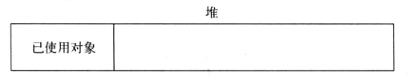
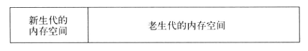
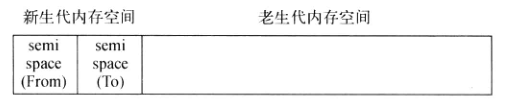
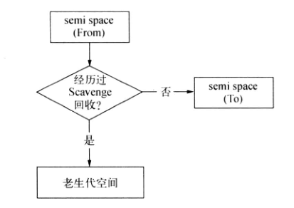
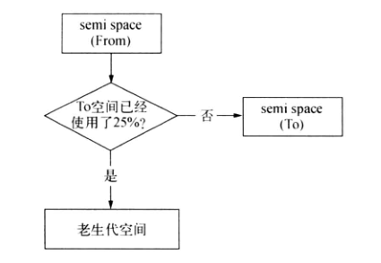
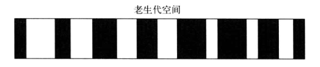
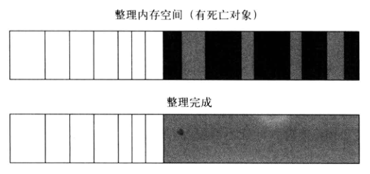
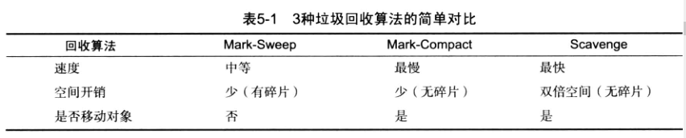

#内存控制

[TOC]

说道内存泄漏，大家首先会想起的也只是早起版本的IE中JavaScript与DOM交互时发生的问题。如果页面的内存占用过多，基本等不到进行垃圾回收，用于已经不耐烦地刷新了当前页面。

基于无阻塞，事件驱动建立的Node服务，具有内存消耗低的有点，非常适合处理海量的网络请求。在海量请求的前提下，开发者就需要考虑一写平常不会形成影响的问题。**内存控制**正式在海量请求和长时间运行的前提下进行探讨的。

##V8的垃圾回收机制与内存限制

我们在学习JS编程中，听说过它和Java一样，由垃圾回收机制来进行自动的内存管理，这使得开发者不想C/C++程序员那样在编写代码的过程中时刻关注内存的分配和释放问题。但在浏览器中进行开发时，几乎很少有人能遇到垃圾回收对应用程序构成性能影响的情况。Node极大扩宽了JS的应用场景，当主流应用场景从客户端延伸到服务器之后，我们就能发现，对于性能敏感的服务器端程序，内存管理的好坏，垃圾回收情况是否优良，都会对服务构成影响。而在Node中，这一切都与Node的JS引擎V8息息相关。

### Node与V8

09年，Node创始人Ryan Dahl选择V8来作为Node的JS脚本引擎，这离不开第三次浏览器大战。那次大战中，Google的Chrome浏览器以期优异的性能成为焦点。V8出现至今，JS一改它作为脚本语言性能低下的形象。V8的性能优势使得JS写高性能后台服务程序成为可能。接下来Ryan Dahl选择了JS，选择了V8，在事件驱动，非阻塞I/O模型的设计下实现了Node。

V8作为虚拟机，性能表现优异，这与它的领导者有莫大的渊源，Chrome的成功离不开它背后的天才------Lars Bak。在开发V8前，其在Sun公司开发高性能的Java虚拟机。

Node在JS的执行上直接受益于V8，可以随着V8的升级享受到更好的性能或新的语言特性（如ES5和ES6）等，同时也受到V8的一些限制，尤其是本章要重点讨论的内存限制

### V8的内存限制

在一般的后端开发语言中，在基本的内存使用上没有什么限制，然而Node中通过JS使用内存时就会发现只能使用部分内存（64位系统下约1.4G，32位系统下约0.7G）。在这样的限制下，会导致Node无法直接操作大内存对象。这样在单个Node进程的情况下，计算机内存的资源无法得到充足的使用。

造成这个原因主要是Node基于V8构建，所以在Node中使用的JS对象基本上都是通过V8自己的方式进行分配和管理的。V8这套内存管理机制在浏览器端绰绰有余，但是对Node，这却限制了开发者随心所欲使用大内存你的想法。

### V8的对象分配

在V8中，所有JS对象都是通过堆来进行分配的。Node提供了V8内存使用情况查询的方式：

```shell
$ node
> process.memoryUsage() # 查询内存使用情况
```

在上述代码中，`memoryUsage()`方法返回3个属性，`heapTotal`和`heapUsed`是V8的堆内存使用情况，前者是已申请到的堆内存，后者是当前使用的量。`rss`后续介绍：



当我们在代码中声明变量并赋值时，所使用对象的内存就是分配在堆中。如果申请的堆空闲内存不够分配新的对象，将继续申请堆内存，直到堆内存的大小超过V8的限制为止。

至于V8为何限制堆大小，表层原因是因为V8设计之初是为浏览器服务的，浏览器用不到那么多内存。深层原因是V8的垃圾回收机制的限制。按照官方的说法，以1.5G的垃圾回收堆内存为例，V8做一次小的垃圾回收需要50毫秒以上，做一次非增量式的垃圾回收甚至需要1秒以上。这是垃圾回收中引起JS线程暂停执行的时间，在这样的时间花销下，应用的性能和相应能力都会直线下降。

当然，这个限制也不是不能打开，V8依然提供了选项让我们使用更多的内存。Node启动时可以传递`--max-old-space-size`和`--max-new-space-size`来调整内存限制的大小。

```shell
> node --max-old-space-size=1700 test.js # MB
> node --max-new-space-size=1024 test.js # KB
```

### V8的垃圾回收机制

再展开介绍V8垃圾回收机制前，有必要简略介绍下V8用到的各种垃圾回收算法。

#### V8主要的垃圾回收算法

V8的垃圾回收策略主要基于分代式垃圾回收机制。在自动垃圾回收的演变过程中，人们发现没有任何一种垃圾回收算法能够胜任所有的场景。因为在实际的应用中，对象的生存周期长短不一，不同算法只能针对特定情况具有最好的效果。为此，统计学在垃圾回收算法的发展中产生了较大的作用，现代的垃圾回收算法中按对象的存活时间将内存的垃圾回收进行不同的分代，然后分别对不同分代的内存施以更高效的算法。

- **V8的内存分代**

  在V8中，主要将内存分为新生代和老生代两代。新生代中的对象为存活时间较短的对象，老生代中的对象为存活时间较长或常驻内存的对象。

  

  V8的整体大小就是新生代所用内存空间加上老生代的内存空间。前面所提及的`--max-old-space-value`可以用于设置老生代内存空间的最大值，`--max-new-space-value`可以用于设置新生代内存空间的最大值。比较遗憾的是，这两个值必须在启动的时候指定，这意味着V8使用的内存没有办法根据情况自动的扩充，当内存超过极限的时候，就会引起进程错误。

  前面提及过，老生代在64位中设置的为1.4GB，在32位系统中设置的为700MB

  对于新生代内存，它由两个`reserved_semispace_size`所构成。`reserved_semispace_size`在64位系统中最大内存为16MB，在32位系统中最大内存为8MB。所以新生代内存在64位系统上最大为32MB，在3位系统中最大为16MB。

  V8堆内存的最大保留空间从源码中可以发现为`4*reserved_semispace_size+max_old_generation_size_`。

  因此，默认情况下，V8堆内存的最大值为64位系统上为1464MB，32为系统上为732MB。这个数值可以解析为何在64位u系统下只能使用约1.4GB内存和32位系统上约0.7GB内存。

- **Scavenge算法**

  在分代基础上，新生代中的对象主要通过**Scavenge算法**进行垃圾回收。在Scavenge的具体实现中，主要采用的是**Cheney算法**。

  Cheney算法是一种采用复制的方式实现的垃圾回收算法。它将堆内存一分为二，每一部分空间称为`semispace`，这两个`semispace`空间中，只有一个处于使用中，另一个处于闲置状态。处于使用状态的`semispace`空间称为**`From`空间**，处于闲置状态的空间称为**`To`空间**。当我们分配对象时，先是在`From`空间进行分配。当开始进行垃圾回收时，会检查`From`空间中的存活对象，这些存活对象将被复制到`To`空间中，而非存活对象占用的空间将被释放。完成复制后，`From`空间和`To`空间角色对换。简而言之，在垃圾回收过程中，就是将存活对象在两个`semispace`空间之间进行复制。

  Scavenge的缺点就是只能使用堆内存中的一般，这是由划分空间和复制机制所决定的。Scavenge由于只复制存活对象，并且对于生命周期短的场景存活对象只占少部分，所以它在时间效率上有优异表现。

  

  **实际使用的堆内存是新生代的两个semispace空间大小和老生代所用内存大小之和**

  当一个对象被多次复制存活后，它将被认为是生命周期较长的对象。这种较长生命周期的对象随后被移动到老生代中，采用新的算法进行管理。对象从新生代到老生代的过程称为**晋升**

  单纯的`Scavenge`过程中，`From`空间存活的对象会被复制到`To`空间，然后两个空间进行角色对换(又称**翻转**)。但在分代式垃圾回收的前提下，`From`空间中存活的对象在复制到`To`空间之前需要进行检查。在一定条件下，需要将存活周期长的对象移动到老生代中，也就是完成晋升。

  对象晋升的条件主要有两个：一个是对象是否经历过`Scavenge`回收，一个是`To`空间的内存占用比超过限制。

  在默认情况下，V8的对象分配主要集中在`From`空间。对象从`From`空间复制到`To`空间时，会检查它的内存地址来判断这个对象是否已经经历过一次Scavenge回收。如果经历过，会将该对象从 `Frome`空间复制到老生代空间中。如果没有就复制到`To`空间中。

  

  另一个判断条件是`To`空间的内存占用比。当从`From`空间复制一个对象到`To`空间时，如果`To`空间已经使用超过25%，则这个对象直接晋升到老生代空间中。

  

  设置25%这个限制是因为当这次的`Scavenge`回收完成后，`To`空间将变成`From`空间，接下来的内存分配将在这里进行。如果占比过高，会影响后续的内存分配。

- **Mark-Sweep & Mark-Compact**

  对于老生代中的对象，由于存货对象占较大比重，再用`Scavenge`的方式会有两个问题：一个是存活对象较多，复制存活对象的效率将会很低；另一个问题依然是浪费一半的空间的问题。所以V8采用了`Mark-Sweep`和`Mark-Compact`相结合的方式进行垃圾回收。

  `Mark-Sweep`是标记清除的意思，它分别为标记和清除两个阶段。与`Scavenge`相比，`Mark-Sweep`并不将内存空间划分为两半，所以不存在内存浪费一般的行为。`Mark-Sweep`在标记阶段遍历堆中的所有对象，并标记活着的对象，在随后的清除阶段，只清除没有标记的对象。

  可以看出`Scavenge`只复制活着的对象，`Mark-Sweep`只清除死亡的对象。活对象在新生代中很少，死对象在老生代中很少。

  

  上图中黑色的是死亡对象。

  `Mark-Sweep`最大的问题是在进行一次标记清除后，内存空间会出现不连续的状态，这种内存碎片会对后续内存分配造成问题，因此很可能出现需要分配一个大对象的情况，这时所有的碎片空间都无法完成分配时，就会提前触发垃圾回收，而这次回收是不必要的。

  为了解决碎片为题，`Mark-Compact`被提出来了，它是标记整理的意思，是在`Mark-Sweep`的基础上演变而来的。他们的差别在于对象在标记为死亡之后，在整理过程中，将活着的对象一端移动，移动完成后，直接清理掉边界外的内存。

  

  白色格子为存活对象，深色格子为死亡对象，浅色格子为存活对象移动后留下的空间。完成移动后，就可以直接清除最后边的存活对象后面的内存区域完成回收。

  