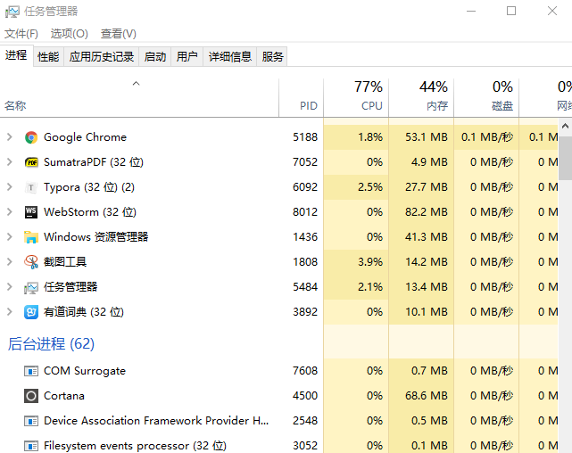
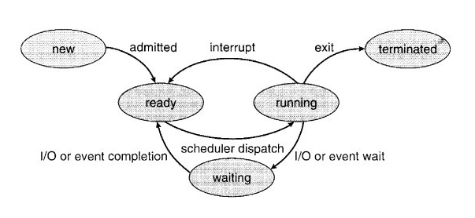

#进程与线程

[TOC]

##0x01 背景

在学习编程中，经常会遇到进程和线程这两个哥们，说实话，我作为初学者，也是每次听的云里雾里的，旺旺陷入迷茫和纠结中。

其实弄懂他们并不是很难。从一定意义上讲，进程就是一个应用程序在电脑上一次执行的过程，它是动态的概念。而线程是进程中的一部分，进程包含多个线程在运行。

##0x02 简介

宏观上来说，

 进程，是并发执行的程序在执行过程中分配和管理资源的基本单位，是一个动态概念，竟争计算机系统资源的基本单位。每一个进程都有一个自己的地址空间，即进程空间或（虚空间）。进程空间的大小 只与处理机的位数有关，一个 16 位长处理机的进程空间大小为 216 ，而 32 位处理机的进程空间大小为 232 。进程至少有 5 种基本状态，它们是：初始状态，执行状态，阻塞状态，就绪状态，终止状态。

- 初始状态(New)

  进程正在创建过程中，还不能运行。操作系统在创建状态要进行的工作包括分配和建立进程控制块表项、建立资源表格(如打开文件表)并分配资源、加载程序并建立地址空间表等。进程创建后将立即进入就绪状态，等待CPU的时间片。

- 执行状态(Running)

  进程占用处理器资源；处于此状态的进程的数目小于等于处理器的数目。在没有其他进程可以执行时(如所有进程都在阻塞状态)，通常会自动执行系统的空闲进程。 执行中，当退出就进入终止状态；当有I/O操作或进程同步等条件而需要暂停时，就进入阻塞状态；当只是计算并不退出，则进入就绪状态等待下次CPU的时间片。

- 阻塞状态(Blocked)

  当进程由于等待I/O操作或进程同步等条件而暂停运行时，它处于阻塞状态。  当退出阻塞状态后，将进入就绪状态，等待CPU的时间片。

- 就绪状态(Ready)

  进程已获得除处理器外的所需资源，等待分配处理器资源；只要分配了处理器进程就可执行。就绪进程可以按多个优先级来划分队列。例如，当一个进程由于时间片用完而进入就绪状态时，排人低优先级队列；当进程由I／O操作完成而进入就绪状态时，排入高优先级队列。

- 终止状态(Exit)

  进程已结束运行，回收除进程控制块之外的其他资源，并让其他进程从进程控制块中收集有关信息(如记帐和将退出代码传递给父进程)。 

线程，在网络或多用户环境下，一个服务器通常需要接收大量且不确定数量用户的并发请求，为每一个请求都创建一个进程显然是行不通的，——无论是从系统资源开销方面或是响应用户请求的效率方面来看。因此，操作系统中线程的概念便被引进了。线程，是进程的一部分，一个没有线程的进程可以被看作是单线程的。线程有时又被称为轻权进程或轻量级进程，也是 CPU 调度的一个基本单位。

##0x03 区别

**进程的执行过程是线状的**，尽管中间会发生中断或暂停，但该进程所拥有的资源只为该线状执行过程服务。一旦发生进程上下文切换，这些资源都是要被保护起来的。这是进程宏观上的执行过程。

而进程又可有单线程进程与多线程进程两种。

我们知道，进程有 一个**进程控制块(PCB)**  , **相关程序段**和 该程序段对其进行操作的**数据结构集** 这三部分。

单线程进程的执行过程在宏观上是线性的，微观上也只有单一的执行过程；而多线程进程在宏观上的执行过程同样为线性的，但微观上却可以有多个执行操作（线程），如不同代码片段以及相关的数据结构集。

**线程的改变只代表了 CPU 执行过程的改变，而没有发生进程所拥有的资源变化。**

除了CPU之外，**计算机内的软硬件资源的分配与线程无关**，线程只能共享它所属进程的资源。

与进程控块 PCB 相似，每个线程也有自己的线程控制块 TCB ，而这个 TCB 中所保存的线程状态信息则要比 PCB 表少得多，这些信息主要是相关指针用堆栈（系统栈和用户栈），寄存器中的状态数据。

**进程拥有一个完整的虚拟地址空间，不依赖于线程而独立存在；反之，线程是进程的一部分，没有自己的地址空间，与进程内的其他线程一起共享分配给该进程的所有资源**。

线程可以有效地提高系统的执行效率，但并不是在所有计算机系统中都是适用的，如某些很少做进程调度和切换的实时系统。

使用线程的好处是有多个任务需要处理机处理时，减少处理机的切换时间；而且，线程的创建和结束所需要的系统开销也比进程的创建和结束要小得多。最适用使用线程的系统是多处理机系统和网络系统或分布式系统。