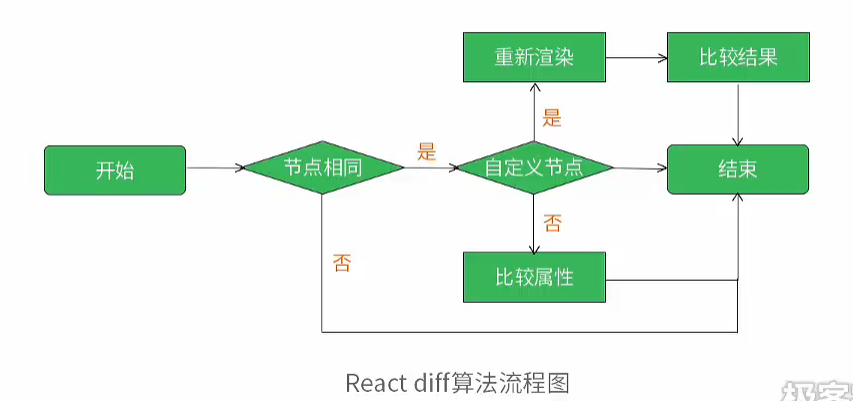
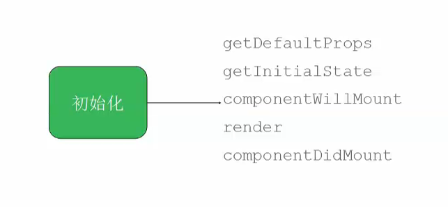
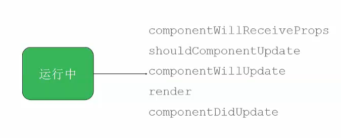
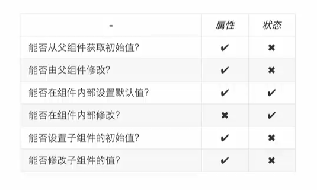

# React深入浅出

[TOC]

## JSX

### 基础

JSX可以当做是React的语法糖或模板语言一样，React将HTML所有标签进行了组件化，这是我们都知道的。如果我们不使用JSX，创建一个`a`标签的方法如下:

```javascript
React.createElement("a", {href="http://www.blackcater.win"}, null);
```

可想而知，这样如果在开发复杂的组件，将会是很头痛的，写起来非常的复杂。但是JSX就不一样了

```html
<a href="http://www.blackcater.win"></a>
```

哇~，这简单程度，完全就是HTML标签嘛！

对，这就是JSX的魅力。

但是JSX就是JavaScript所以，有一些属性如`class`, `for`是不能直接使用的，可以用`className`, `htmlFor`进行替代。

### 延展属性

JSX的属性定义形式如下:

```html
var component = <Component foo={x} bar={y}/>;
```

Props是`properties`的简写。

JSX在进行属性定义时不要进行如下的写法:

```html
var component = <Component />;
component.props.bar = y;
component.props.foo = x;
```

这样是反模式的写法，会绕过React内部的属性类型检查(propTypes)。这样，当你属性有错，是不会有任何提醒的。

### HTML实体

React默认会对内部所有字符串进行转义，防止XSS攻击。所以有以下方式绕过该现象

```html
<div>First &middot; Second</div>

<div>{'First · Second'}</div>

<div>{'First \u00b7 Second'}</div>
<div>{'First ' + String.fromCharCode(183) + ' Second'}</div>

<div>{['First ', <span>&middot;</span>, ' Second']}</div>

<div dangerouslySetInnerHTML={{__html: 'First &middot; Second'}} />
```

### 自定义HTML属性

```html
<div data-custom-attribute="foo" /> <!-- 如果往原生 HTML 元素里传入 HTML 规范里不存在的属性，React 不会显示它们。如果需要使用自定义属性，要加 data- 前缀。 -->

<div aria-hidden={true} /> <!-- 以 aria- 开头的 [网络无障碍] 属性可以正常使用。 -->
```


## 事件与State确定

### 事件处理与合成事件（Synthetic Events）

React 里只需把事件处理器（event handler）以骆峰命名（camelCased）形式当作组件的 props 传入即可，就像使用普通 HTML 那样。React 内部创建一套合成事件系统来使所有事件在 IE8 和以上浏览器表现一致。也就是说，React 知道如何冒泡和捕获事件，而且你的事件处理器接收到的 events 参数与 [W3C 规范](http://www.w3.org/TR/DOM-Level-3-Events/) 一致，无论你使用哪种浏览器。

如果需要在手机或平板等触摸设备上使用 React，需要调用`React.initializeTouchEvents(true);` 启用触摸事件处理。

### 幕后原理：自动绑定和事件代理

在幕后，React 做了一些操作来让代码高效运行且易于理解。

**Autobinding:** 在 JavaScript 里创建回调的时候，为了保证 `this` 的正确性，一般都需要显式地绑定方法到它的实例上。有了 React，所有方法被自动绑定到了它的组件实例上。React 还缓存这些绑定方法，所以 CPU 和内存都是非常高效。而且还能减少打字！

**事件代理 ：** React 实际并没有把事件处理器绑定到节点本身。当 React 启动的时候，它在最外层使用唯一一个事件监听器处理所有事件。当组件被加载和卸载时，只是在内部映射里添加或删除事件处理器。当事件触发，React 根据映射来决定如何分发。当映射里处理器时，会当作空操作处理。参考 [David Walsh 很棒的文章](http://davidwalsh.name/event-delegate) 了解这样做高效的原因。

### 组件其实是状态机（State Machines）

React 把用户界面当作简单状态机。把用户界面想像成拥有不同状态然后渲染这些状态，可以轻松让用户界面和数据保持一致。

React 里，只需更新组件的 state，然后根据新的 state 重新渲染用户界面（不要操作 DOM）。React 来决定如何最高效地更新 DOM。

### State 工作原理

常用的通知 React 数据变化的方法是调用 `setState(data, callback)`。这个方法会合并（merge） `data` 到 `this.state`，并重新渲染组件。渲染完成后，调用可选的 `callback`回调。大部分情况下不需要提供 `callback`，因为 React 会负责把界面更新到最新状态。

#### 哪些组件应该有 State？

大部分组件的工作应该是从 `props` 里取数据并渲染出来。但是，有时需要对用户输入、服务器请求或者时间变化等作出响应，这时才需要使用 State。

** 尝试把尽可能多的组件无状态化。** 这样做能隔离 state，把它放到最合理的地方，也能减少冗余，同时易于解释程序运作过程。

常用的模式是创建多个只负责渲染数据的无状态（stateless）组件，在它们的上层创建一个有状态（stateful）组件并把它的状态通过 `props` 传给子级。这个有状态的组件封装了所有用户的交互逻辑，而这些无状态组件则负责声明式地渲染数据。

#### 哪些 *应该* 作为 State？

**State 应该包括那些可能被组件的事件处理器改变并触发用户界面更新的数据。** 真实的应用中这种数据一般都很小且能被 JSON 序列化。当创建一个状态化的组件时，想象一下表示它的状态最少需要哪些数据，并只把这些数据存入 `this.state`。在 `render()` 里再根据 state 来计算你需要的其它数据。你会发现以这种方式思考和开发程序最终往往是正确的，因为如果在 state 里添加冗余数据或计算所得数据，需要你经常手动保持数据同步，不能让 React 来帮你处理。

#### 哪些 *不应该* 作为 State？

`this.state` 应该仅包括能表示用户界面状态所需的最少数据。因此，它不应该包括：

- **计算所得数据：** 不要担心根据 state 来预先计算数据 —— 把所有的计算都放到`render()` 里更容易保证用户界面和数据的一致性。例如，在 state 里有一个数组（listItems），我们要把数组长度渲染成字符串， 直接在 `render()` 里使用`this.state.listItems.length + ' list items'` 比把它放到 state 里好的多。
- **React 组件：** 在 `render()` 里使用当前 props 和 state 来创建它。
- **基于 props 的重复数据：** 尽可能使用 props 来作为惟一数据来源。把 props 保存到 state 的一个有效的场景是需要知道它以前值的时候，因为未来的 props 可能会变化。


## 复合组件

### 动机：关注分离

通过复用那些接口定义良好的组件来开发新的模块化组件，我们得到了与使用函数和类相似的好处。具体来说就是能够通过开发简单的组件把程序的*不同关注面分离*。如果为程序开发一套自定义的组件库，那么就能以最适合业务场景的方式来展示你的用户界面。

### 从属关系

```javascript
var Avatar = React.createClass({
  render: function() {
    return (
      <div>
        <ProfilePic username={this.props.username} />
        <ProfileLink username={this.props.username} />
      </div>
    );
  }
});

var ProfilePic = React.createClass({
  render: function() {
    return (
      
    );
  }
});

var ProfileLink = React.createClass({
  render: function() {
    return (
      <a href={'http://www.facebook.com/' + this.props.username}>
        {this.props.username}
      </a>
    );
  }
});

React.render(
  <Avatar username="pwh" />,
  document.getElementById('example')
);
```

上面例子中，`Avatar` 拥有 `ProfilePic` 和 `ProfileLink` 的实例。`拥有者` 就是给其它组件设置 `props` 的那个组件。更正式地说， 如果组件 `Y` 在 `render()` 方法是创建了组件 `X`，那么 `Y` 就拥有 `X`。上面讲过，组件不能修改自身的 `props` - 它们总是与它们拥有者设置的保持一致。这是保持用户界面一致性的关键性原则。

把从属关系与父子关系加以区别至关重要。从属关系是 React 特有的，而父子关系简单来讲就是DOM 里的标签的关系。在上一个例子中，`Avatar` 拥有 `div`、`ProfilePic` 和`ProfileLink` 实例，`div` 是 `ProfilePic` 和 `ProfileLink` 实例的**父级**（但不是拥有者）。

### 子级

实例化 React 组件时，你可以在开始标签和结束标签之间引用在React 组件或者Javascript 表达式：

```html
<Parent><Child /></Parent>
```

`Parent` 能通过专门的 `this.props.children` props 读取子级。**this.props.children 是一个不透明的数据结构：** 通过 [React.Children 工具类](http://reactjs.cn/react/docs/top-level-api.html#react.children) 来操作。

#### 子级校正（Reconciliation）

**校正就是每次 render 方法调用后 React 更新 DOM 的过程。** 一般情况下，子级会根据它们被渲染的顺序来做校正。例如，下面代码描述了两次渲染的过程：

```html
// 第一次渲染
<Card>
  <p>Paragraph 1</p>
  <p>Paragraph 2</p>
</Card>
// 第二次渲染
<Card>
  <p>Paragraph 2</p>
</Card>
```

直观来看，只是删除了`Paragraph 1`。事实上，React 先更新第一个子级的内容，然后删除最后一个组件。React 是根据子级的*顺序*来校正的。

#### 子组件状态管理

对于大多数组件，这没什么大碍。但是，对于使用 `this.state` 来在多次渲染过程中里维持数据的状态化组件，这样做潜在很多问题。

多数情况下，可以通过隐藏组件而不是删除它们来绕过这些问题。

```html
// 第一次渲染
<Card>
  <p>Paragraph 1</p>
  <p>Paragraph 2</p>
</Card>
// 第二次渲染
<Card>
  <p style={{display: 'none'}}>Paragraph 1</p>
  <p>Paragraph 2</p>
</Card>
```

#### 动态子级

如果子组件位置会改变（如在搜索结果中）或者有新组件添加到列表开头（如在流中）情况会变得更加复杂。如果子级要在多个渲染阶段保持自己的特征和状态，在这种情况下，你可以通过给子级设置惟一标识的 `key` 来区分。

```javascript
  render: function() {
    var results = this.props.results;
    return (
      <ol>
        {results.map(function(result) {
          return <li key={result.id}>{result.text}</li>;
        })}
      </ol>
    );
  }
```

当 React 校正带有 key 的子级时，它会确保它们被重新排序（而不是破坏）或者删除（而不是重用）。 `务必` 把 `key` 添加到子级数组里组件本身上，而不是每个子级内部最外层 HTML 上：

```javascript
// 错误！
var ListItemWrapper = React.createClass({
  render: function() {
    return <li key={this.props.data.id}>{this.props.data.text}</li>;
  }
});
var MyComponent = React.createClass({
  render: function() {
    return (
      <ul>
        {this.props.results.map(function(result) {
          return <ListItemWrapper data={result}/>;
        })}
      </ul>
    );
  }
});

// 正确 :)
var ListItemWrapper = React.createClass({
  render: function() {
    return <li>{this.props.data.text}</li>;
  }
});
var MyComponent = React.createClass({
  render: function() {
    return (
      <ul>
        {this.props.results.map(function(result) {
           return <ListItemWrapper key={result.id} data={result}/>;
        })}
      </ul>
    );
  }
});
```

也可以传递 object 来做有 key 的子级。object 的 key 会被当作每个组件的 `key`。但是一定要牢记 JavaScript 并不总是保证属性的顺序会被保留。实际情况下浏览器一般会保留属性的顺序，**除了** 使用 32位无符号数字做为 key 的属性。数字型属性会按大小排序并且排在其它属性前面。一旦发生这种情况，React 渲染组件的顺序就是混乱。可能在 key 前面加一个字符串前缀来避免：

```javascript
  render: function() {
    var items = {};

    this.props.results.forEach(function(result) {
      // 如果 result.id 看起来是一个数字（比如短哈希），那么
      // 对象字面量的顺序就得不到保证。这种情况下，需要添加前缀
      // 来确保 key 是字符串。
      items['result-' + result.id] = <li>{result.text}</li>;
    });

    return (
      <ol>
        {items}
      </ol>
    );
  }
```

### 数据流

React 里，数据通过上面介绍过的 `props` 从拥有者流向归属者。这就是高效的单向数据绑定(one-way data binding)：拥有者通过它的 `props` 或 `state` 计算出一些值，并把这些值绑定到它们拥有的组件的 props 上。因为这个过程会递归地调用，所以数据变化会自动在所有被使用的地方自动反映出来。

### 性能提醒

你或许会担心如果一个拥有者有大量子级时，对于数据变化做出响应非常耗费性能。值得庆幸的是执行 JavaScript 非常的快，而且 `render()` 方法一般比较简单，所以在大部分应用里这样做速度极快。此外，性能的瓶颈大多是因为 DOM 更新，而非 JS 执行，而且 React 会通过批量更新和变化检测来优化性能。

但是，有时候需要做细粒度的性能控制。这种情况下，可以重写 `shouldComponentUpdate()`方法返回 false 来让 React 跳过对子树的处理。参考 [React reference docs](http://reactjs.cn/react/docs/component-specs.html) 了解更多。

如果在数据变化时让 `shouldComponentUpdate()` 返回 false，React 就不能保证用户界面同步。当使用它的时候一定确保你清楚到底做了什么，并且只在遇到明显性能问题的时候才使用它。不要低估 JavaScript 的速度，DOM 操作通常才是慢的原因。


## 可复用组件

### Prop验证

应用的变大，为了保证组件正确使用，React提供了`React.PropTypes`提供很多验证器来验证传入的数据类型的有效性。下面是一些例子

```javascript
React.createClass({
  propTypes: {
    // 可以声明 prop 为指定的 JS 基本类型。默认
    // 情况下，这些 prop 都是可传可不传的。
    optionalArray: React.PropTypes.array,
    optionalBool: React.PropTypes.bool,
    optionalFunc: React.PropTypes.func,
    optionalNumber: React.PropTypes.number,
    optionalObject: React.PropTypes.object,
    optionalString: React.PropTypes.string,

    // 所有可以被渲染的对象：数字，
    // 字符串，DOM 元素或包含这些类型的数组。
    optionalNode: React.PropTypes.node,

    // React 元素
    optionalElement: React.PropTypes.element,

    // 用 JS 的 instanceof 操作符声明 prop 为类的实例。
    optionalMessage: React.PropTypes.instanceOf(Message),

    // 用 enum 来限制 prop 只接受指定的值。
    optionalEnum: React.PropTypes.oneOf(['News', 'Photos']),

    // 指定的多个对象类型中的一个
    optionalUnion: React.PropTypes.oneOfType([
      React.PropTypes.string,
      React.PropTypes.number,
      React.PropTypes.instanceOf(Message)
    ]),

    // 指定类型组成的数组
    optionalArrayOf: React.PropTypes.arrayOf(React.PropTypes.number),

    // 指定类型的属性构成的对象
    optionalObjectOf: React.PropTypes.objectOf(React.PropTypes.number),

    // 特定形状参数的对象
    optionalObjectWithShape: React.PropTypes.shape({
      color: React.PropTypes.string,
      fontSize: React.PropTypes.number
    }),

    // 以后任意类型加上 `isRequired` 来使 prop 不可空。
    requiredFunc: React.PropTypes.func.isRequired,

    // 不可空的任意类型
    requiredAny: React.PropTypes.any.isRequired,

    // 自定义验证器。如果验证失败需要返回一个 Error 对象。不要直接
    // 使用 `console.warn` 或抛异常，因为这样 `oneOfType` 会失效。
    customProp: function(props, propName, componentName) {
      if (!/matchme/.test(props[propName])) {
        return new Error('Validation failed!');
      }
    }
  }
})
```

### 单个子级

```javascript
React.createClass({
  propTypes: {
  	children: React.PropTypes.element.isRequire
  },
  render: function() {
    return (
      <div>
        {this.props.children} // 有且仅有一个元素，否则会抛异常。
      </div>
    );
  }
})
```

### Mixins

组件是 React 里复用代码最佳方式，但是有时一些复杂的组件间也需要共用一些功能。有时会被称为 [跨切面关注点](http://en.wikipedia.org/wiki/Cross-cutting_concern)。React 使用 `mixins` 来解决这类问题。

一个通用的场景是：一个组件需要定期更新。用 `setInterval()` 做很容易，但当不需要它的时候取消定时器来节省内存是非常重要的。React 提供 [生命周期方法](http://reactjs.cn/react/docs/working-with-the-browser.html#component-lifecycle) 来告知组件创建或销毁的时间。下面来做一个简单的 mixin，使用 `setInterval()` 并保证在组件销毁时清理定时器。

```javascript
var SetIntervalMixin = {
  componentWillMount: function() { // 组件生存周期方法
    this.intervals = [];
  },
  setInterval: function() {
    this.intervals.push(setInterval.apply(null, arguments));
  },
  componentWillUnmount: function() { // 组件生存周期方法
    this.intervals.map(clearInterval);
  }
};

var TickTock = React.createClass({
  mixins: [SetIntervalMixin], // 引用 mixin 可以引入多个
  getInitialState: function() {
    return {seconds: 0};
  },
  componentDidMount: function() {
    this.setInterval(this.tick, 1000); // 调用 mixin 的方法
  },
  tick: function() {
    this.setState({seconds: this.state.seconds + 1});
  },
  render: function() {
    return (
      <p>
        React has been running for {this.state.seconds} seconds.
      </p>
    );
  }
});

React.render(
  <TickTock />,
  document.getElementById('example')
);
```

关于 mixin 值得一提的优点是，如果一个组件使用了多个 mixin，并且有多个 mixin 定义了同样的生命周期方法（如：多个 mixin 都需要在组件销毁时做资源清理操作），所有这些生命周期方法都保证会被执行到。方法执行顺序是：首先按 mixin 引入顺序执行 mixin 里方法，最后执行组件内定义的方法。

说白了就是有点像对象的拷贝，将一个对象的方法移入另一个对象。


## Props

props一旦定义在组件中，就是无法被修改的。

### 传递Props

#### 手动传递

```javascript
var FancyCheckbox = React.createClass({
  render: function() {
    var fancyClass = this.props.checked ? 'FancyChecked' : 'FancyUnchecked';
    return (
      <div className={fancyClass} onClick={this.props.onClick}>
        {this.props.children}
      </div>
    );
  }
});
React.render(
  <FancyCheckbox checked={true} onClick={console.log.bind(console)}>
    Hello world!
  </FancyCheckbox>,
  document.body
);
```


## 表单组件

### 交互属性

表单组件支持几个受用户交互影响的属性：

- `value`，用于 `<input>`、`<textarea>` 组件。
- `checked`，用于类型为 `checkbox` 或者 `radio` 的 `<input>` 组件。
- `selected`，用于 `<option>` 组件。

在 HTML 中，`<textarea>` 的值通过子节点设置；在 React 中则应该使用 `value` 代替。

表单组件可以通过 `onChange` 回调函数来监听组件变化。当用户做出以下交互时，`onChange` 执行并通过浏览器做出响应：

- `<input>` 或 `<textarea>` 的 `value` 发生变化时。
- `<input>` 的 `checked` 状态改变时。
- `<option` 的 `selected` 状态改变时。

和所有 DOM 事件一样，所有的 HTML 原生组件都支持 `onChange` 属性，而且可以用来监听冒泡的 `change` 事件。

### 受限组件

设置了 `value` 的 `` 是一个受限组件。 对于受限的 ``，渲染出来的 HTML 元素始终保持 `value` 属性的值。例如：

```javascript
 render: function() {
    return <input type="text" value="Hello!" />;
  }
```

上面的代码将渲染出一个值为 `Hello!` 的 input 元素。用户在渲染出来的元素里输入任何值都不起作用，因为 React 已经赋值为 `Hello!`。如果想响应更新用户输入的值，就得使用`onChange` 事件：

```javascript
getInitialState: function() {
    return {value: 'Hello!'};
  },
  handleChange: function(event) {
    this.setState({value: event.target.value});
  },
  render: function() {
    var value = this.state.value;
    return <input type="text" value={value} onChange={this.handleChange} />;
  }
```

上面的代码中，React 将用户输入的值更新到 `` 组件的 `value` 属性。这样实现响应或者验证用户输入的界面就很容易了。例如：

```javascript
handleChange: function(event) {
    this.setState({value: event.target.value.substr(0, 140)}); // 校验数据不能超过140字符
  }
```

### 不受限组件

没有设置 `value`(或者设为 `null`) 的 `` 组件是一个*不受限*组件。对于不受限的`` 组件，渲染出来的元素直接反应用户输入。例如：

```javascript
render: function() {
  return <input type="text" />;
}
```

如果想给组件设置一个非空的初始值，可以使用 `defaultValue` 属性。例如：

```javascript
render: function() {
  return <input type="text" defaultValue="Hello!" />;
}
```

上面的代码渲染出来的元素和**受限组件**一样有一个初始值，但这个值用户可以改变并会反应到界面上。

同样地， 类型为 `radio`、`checkbox` 的`<input>` 支持 `defaultChecked` 属性， `<select>`支持 `defaultValue` 属性。

```javascript
render: function() {
  return (
    <div>
      <input type="radio" name="opt" defaultChecked /> Option 1
      <input type="radio" name="opt" /> Option 2
      <select defaultValue="C">
        <option value="A">Apple</option>
        <option value="B">Banana</option>
        <option value="C">Cranberry</option>
      </select>
    </div>
  );
}
```

### 高级主题

#### 为什么使用受限组件？

在 HTML 中将渲染初始值为 `Untitled` 的输入框。用户改变输入框的值时，节点的 `value`属性（*property*）将随之变化，但是 `node.getAttribute('value')` 还是会返回初始设置的值 `Untitled`.

与 HTML 不同，React 组件必须在任何时间点描绘视图的状态，而不仅仅是在初始化时。比如在 React 中：

```javascript
  render: function() {
    return <input type="text" name="title" value="Untitled" />;
  }
```

该方法在任何时间点渲染组件以后，输入框的值就应该*始终*为 `Untitled`。

#### 为什么`<textarea />` 使用value属性?

在 HTML 中， `<textarea>` 的值通常使用子节点设置：

```html
  <!-- 反例：在 React 中不要这样使用！ -->
  <textarea name="description">This is the description.</textarea>
```

对 HTML 而言，让开发者设置多行的值很容易。但是，React 是 JavaScript，没有字符限制，可以使用 `\n` 实现换行。简言之，React 已经有 `value`、`defaultValue` 属性，`` 组件的子节点扮演什么角色就有点模棱两可了。基于此， 设置`` 值时不应该使用子节点：

```html
  <textarea name="description" value="This is a description." />
```

如果*非要*使用子节点，效果和使用 `defaultValue` 一样。

#### 为什么`<select />`使用value属性?

HTML 中 `` 通常使用 `` 的 `selected` 属性设置选中状态；React 为了更方面的控制组件，采用以下方式代替：

```html
  <select value="B">
    <option value="A">Apple</option>
    <option value="B">Banana</option>
    <option value="C">Cranberry</option>
  </select>
```

如果是不受限组件，则使用 `defaultValue`。

注意：

给 `value` 属性传递一个数组，可以选中多个选项：`<select multiple={true} value={['B', 'C']}>`。


## 浏览器中的工作原理

React提供了强大的抽象，让你在大多数应用场景中不再直接操作DOM，但是有时你需要简单地调用底层的API，或者借助于第三方库或已有的代码。

### 虚拟DOM

React是很快的，因为它从不直接操作DOM。React在内存中维护一个快速响应的DOM描述。`render()`方法返回一个DOM的*描述*，React能够利用内存中的描述来快速地计算出差异，然后更新浏览器中的DOM。

另外，React实现了一个完备的虚拟事件系统，尽管各个浏览器都有自己的怪异行为，React确保所有事件对象都符合W3C规范，并且持续冒泡，用一种高性能的方式跨浏览器（and everything bubbles consistently and in a performant way cross-browser）。你甚至可以在IE8中使用一些HTML5的事件！

大多数时候你应该呆在React的“虚拟浏览器”世界里面，因为它性能更加好，并且容易思考。但是，有时你简单地需要调用底层的API，或许借助于第三方的类似于jQuery插件这种库。React为你提供了直接使用底层DOM API的途径。

### Refs和getDOMNode()

为了和浏览器交互，你将需要对DOM节点的引用。每一个挂载的React组件有一个`getDOMNode()`方法，你可以调用这个方法来获取对该节点的引用。

注意：

`getDOMNode()`仅在挂载的组件上有效（也就是说，组件已经被放进了DOM中）。如果你尝试在一个未被挂载的组件上调用这个函数（例如在创建组件的`render()`函数中调用`getDOMNode()`），将会抛出异常。

为了获取一个到React组件的引用，你可以使用`this`来得到当前的React组件，或者你可以使用refs来指向一个你拥有的组件。它们像这样工作：

```javascript
var MyComponent = React.createClass({
  handleClick: function() {
    // Explicitly focus the text input using the raw DOM API.
    this.refs.myTextInput.getDOMNode().focus();
  },
  render: function() {
    // The ref attribute adds a reference to the component to
    // this.refs when the component is mounted.
    return (
      <div>
        <input type="text" ref="myTextInput" />
        <input
          type="button"
          value="Focus the text input"
          onClick={this.handleClick}
        />
      </div>
    );
  }
});

React.render(
  <MyComponent />,
  document.getElementById('example')
);
```

### 组件生命周期

组件的生命周期包含三个主要部分：

- **挂载：** 组件被插入到DOM中。
- **更新：** 组件被重新渲染，查明DOM是否应该刷新。
- **移除：** 组件从DOM中移除。

React提供生命周期方法，你可以在这些方法中放入自己的代码。我们提供**will**方法，会在某些行为发生之前调用，和**did**方法，会在某些行为发生之后调用。

#### 挂载

- `getInitialState(): object`在组件被挂载之前调用。状态化的组件应该实现这个方法，返回初始的state数据。
- `componentWillMount()`在挂载发生之前立即被调用。
- `componentDidMount()`在挂载结束之后马上被调用。需要DOM节点的初始化操作应该放在这里。

#### 更新

- `componentWillReceiveProps(object nextProps)`当一个挂载的组件接收到新的props的时候被调用。该方法应该用于比较`this.props`和`nextProps`，然后使用`this.setState()`来改变state。
- `shouldComponentUpdate(object nextProps, object nextState): boolean`当组件做出是否要更新DOM的决定的时候被调用。实现该函数，优化`this.props`和`nextProps`，以及`this.state`和`nextState`的比较，如果不需要React更新DOM，则返回false。
- `componentWillUpdate(object nextProps, object nextState)`在更新发生之前被调用。你可以在这里调用`this.setState()`。
- `componentDidUpdate(object prevProps, object prevState)`在更新发生之后调用。

#### 移除

- `componentWillUnmount()`在组件移除和销毁之前被调用。清理工作应该放在这里。

#### 挂载的方法（Mounted Methods）

*挂载的*复合组件也支持如下方法：

- `getDOMNode(): DOMElement`可以在任何挂载的组件上面调用，用于获取一个指向它的渲染DOM节点的引用。
- `forceUpdate()`当你知道一些很深的组件state已经改变了的时候，可以在该组件上面调用，而不是使用`this.setState()`。


## 关于Refs的更多内容

在从 render 方法中返回 UI 结构之后，你可能想冲出 React 虚拟 DOM 的限制，在 render 返回的组件实例上调用某些方法。通常来说，这样做对于应用中的数据流动是不必要的，因为活跃的数据（ Reactive data ）流总是确保最新的 `props` 被传递到每一个从 `render()` 输出的子级中去。然而，仍然有几个场景使用这种方式是必须的，或者说是有益的。

考虑这样的场景：让 `<input />` 元素（存在于实例的子层级中）在值被设为空字符串 `''`之后获得焦点。

```javascript
  var App = React.createClass({
    getInitialState: function() {
      return {userInput: ''};
    },
    handleChange: function(e) {
      this.setState({userInput: e.target.value});
    },
    clearAndFocusInput: function() {
      this.setState({userInput: ''}); // Clear the input
      // We wish to focus the <input /> now!
    },
    render: function() {
      return (
        <div>
          <div onClick={this.clearAndFocusInput}>
            Click to Focus and Reset
          </div>
          <input
            value={this.state.userInput}
            onChange={this.handleChange}
          />
        </div>
      );
    }
  });
```

注意，在示例中，我们想“告诉” input 元素一些东西 - 这些东西过会儿之后已无法从它的 props 中推算出来。在这个场景中，我们想“通知” input 元素，现在应该处于获取焦点状态。然而，此处有一些障碍。从 `render()` 中返回的内容并不是你实际创建的`子`组件的组合，仅仅是一个某一刻某个组件实例的 *描述* - 一个快照。

注意：

记住，从 `render()` 中返回的内容并不是*实际*渲染出来的子组件实例。从 `render()`返回的仅仅是子组件层级树实例在特定时间的一个*描述*。

这意味着千万不要紧紧抓住 `render()` 返回的东西不放，然后还一厢情愿地希望生成自己想象中的东西。

```javascript
  // counterexample: DO NOT DO THIS!
  render: function() {
    var myInput = <input />;          // I'm going to try to call methods on this
    this.rememberThisInput = myInput; // input at some point in the future! YAY!
    return (
      <div>
        <div>...</div>
        {myInput}
      </div>
    );
  }
```

在这个反例中，`<input />` 仅仅是一个 `<input />` 组件的*描述*。该描述用于创建一个*真正的* `<input />` 的**支撑实例（ backing instance ）**。

所以，我们如何与*真正的* input 支撑实例（ backing instance ） 交流？

### ref属性

React 支持一种非常特殊的属性，你可以用来绑定到 `render()` 输出的任何组件上去。这个特殊的属性允许你引用 `render()` 返回的相应的**支撑实例（ backing instance ）**。这样就可以确保在任何时间总是拿到正确的实例。

做法很简单：

1、绑定一个 `ref` 属性到 `render` 返回的东西上面去，例如：

```
  <input ref="myInput" />

```

2、在其它代码中（典型地事件处理代码），通过 `this.refs` 获取**支撑实例（ backing instance ）**，就像这样：

```
  this.refs.myInput
```

你可以通过调用 `this.refs.myInput.getDOMNode()` 直接获取到组件的 DOM 节点。

所以上面例子实现如下：

```javascript
    clearAndFocusInput: function() {
      // Clear the input
      this.setState({userInput: ''}, function() {
        // This code executes after the component is re-rendered
        this.refs.theInput.getDOMNode().focus();   // Boom! Focused!
      });
    },
```


## 插件

`React.addons` 是为了构建 React 应用而放置的一些有用工具的地方。**此功能应当被视为实验性的**，但最终将会被添加进核心代码中或者有用的工具库中：

- [`TransitionGroup`和`CSSTransitionGroup`](http://reactjs.cn/react/docs/animation.html)，用于处理动画和过渡，这些通常实现起来都不简单，例如在一个组件移除之前执行一段动画。
- [`LinkedStateMixin`](http://reactjs.cn/react/docs/two-way-binding-helpers.html)，用于简化用户表单输入数据和组件 state 之间的双向数据绑定。
- [`classSet`](http://reactjs.cn/react/docs/class-name-manipulation.html)，用于更加干净简洁地操作 DOM 中的 `class` 字符串。
- [`cloneWithProps`](http://reactjs.cn/react/docs/clone-with-props.html)，用于实现 React 组件浅复制，同时改变它们的 props 。
- [`update`](http://reactjs.cn/react/docs/update.html)，一个辅助方法，使得在 JavaScript 中处理不可变数据更加容易。
- [`PureRenderMixin`](http://reactjs.cn/react/docs/pure-render-mixin.html)，在某些场景下的性能检测器。

以下插件只存在于 React 开发版（未压缩）：

- [`TestUtils`](http://reactjs.cn/react/docs/test-utils.html)， 简单的辅助工具，用于编写测试用例（仅存在于未压缩版）.
- [`Perf`](http://reactjs.cn/react/docs/perf.html)，用于性能测评，并帮助你检查出可优化的功能点。

## 动画

### 高级API：`ReactCSSTransitionGroup`

`ReactCSSTransitionGroup`是基于`ReactTransitionGroup`的，在React组件进入或者离开DOM的时候，它是一种简单地执行CSS过渡和动画的方式。这个的灵感来自于优秀的[ng-animate](http://www.nganimate.org/)库。

```javascript
var ReactCSSTransitionGroup = React.addons.CSSTransitionGroup;

var TodoList = React.createClass({
  getInitialState: function() {
    return {items: ['hello', 'world', 'click', 'me']};
  },
  handleAdd: function() {
    var newItems =
      this.state.items.concat([prompt('Enter some text')]);
    this.setState({items: newItems});
  },
  handleRemove: function(i) {
    var newItems = this.state.items;
    newItems.splice(i, 1);
    this.setState({items: newItems});
  },
  render: function() {
    var items = this.state.items.map(function(item, i) {
      return (
        <div key={item} onClick={this.handleRemove.bind(this, i)}>
          {item}
        </div>
      );
    }.bind(this));
    return (
      <div>
        <button onClick={this.handleAdd}>Add Item</button>
        <ReactCSSTransitionGroup transitionName="example">
          {items}
        </ReactCSSTransitionGroup>
      </div>
    );
  }
});
```

注意：

你必须为`ReactCSSTransitionGroup`的所有子级提供[`键`属性](http://reactjs.cn/react/docs/multiple-components.html#dynamic-children)，即使只渲染一项。这就是React确定哪一个子级插入了，移除了，或者停留在那里。

在这个组件当中，当一个新的项被添加到`ReactCSSTransitionGroup`，它将会被添加`example-enter`类，然后在下一时刻被添加`example-enter-active` CSS类。这是一个基于`transitionName` prop的约定。

```css
.example-enter {
  opacity: 0.01;
  transition: opacity .5s ease-in;
}

.example-enter.example-enter-active {
  opacity: 1;
}

.example-leave {
  opacity: 1;
  transition: opacity .5s ease-in;
}

.example-leave.example-leave-active {
  opacity: 0.01;
}
```

#### 一组动画必须要挂载了才能生效

为了能够给它的子级应用过渡效果，`ReactCSSTransitionGroup`必须已经挂载到了DOM。下面的例子不会生效，因为`ReactCSSTransitionGroup`被挂载到新项，而不是新项被挂载到`ReactCSSTransitionGroup`里。

```javascript
render: function() {
    var items = this.state.items.map(function(item, i) {
      return (
        <div key={item} onClick={this.handleRemove.bind(this, i)}>
          <ReactCSSTransitionGroup transitionName="example">
            {item}
          </ReactCSSTransitionGroup>
        </div>
      );
    }, this);
    return (
      <div>
        <button onClick={this.handleAdd}>Add Item</button>
        {items}
      </div>
    );
  }
```

#### 让一项或者零项动起来

虽然在上面的例子中，我们渲染了一个项目列表到`ReactCSSTransitionGroup`里，`ReactCSSTransitionGroup`的子级可以是一个或零个项目。这使它能够让一个元素实现进入和离开的动画。同样，你可以通过移动一个新的元素来替换当前元素。随着新元素的移入，当前元素移出。例如，我们可以由此实现一个简单的图片轮播器：

**禁用动画**

如果你想，你可以禁用`入场`或者`出场`动画。例如，有些时候，你可能想要一个`入场`动画，不要`出场`动画，但是`ReactCSSTransitionGroup`会在移除DOM节点之前等待一个动画完成。你可以给`ReactCSSTransitionGroup`添加`transitionEnter={false}`或者`transitionLeave={false}` props来禁用这些动画。

**小结**

```javascript
var ReactCSSTransitionGroup = React.addons.CSSTransitionGroup; // 第一步
// 调用
<ReactCSSTransitionGroup transitionName="example" transitionEnter="true" transitionLeave="false">
  {// do something}
</ReactCSSTransitionGroup>
  
  // transitionName : 进入调用 example-enter(进入前) example-enter-active(进入后) example-leave(离开前) example-leave-active(离开后)
```

### 底层API：ReactTransitionGroup

`ReactTransitionGroup`是动画的基础。它可以通过`React.addons.TransitionGroup`得到。当子级被添加或者从其中移除（就像上面的例子）的时候，特殊的生命周期函数就会在它们上面被调用。

#### `componentWillEnter(callback)`

在组件被添加到已有的`TransitionGroup`中的时候，该函数和`componentDidMount()`被同时调用。这将会阻塞其它动画触发，直到`callback`被调用。该函数不会在`TransitionGroup`初始化渲染的时候调用。

#### `componentDidEnter()`

该函数在传给`componentWillEnter`的`callback`函数被调用之后调用。

#### `componentWillLeave(callback)`

该函数在子级从`ReactTransitionGroup`中移除的时候调用。虽然子级被移除了，`ReactTransitionGroup`将会使它继续在DOM中，直到`callback`被调用。

#### `componentDidLeave()`

该函数在`willLeave` `callback`被调用的时候调用（与`componentWillUnmount`是同一时间）。


## 双向数据绑定辅助工具

`ReactLink`是一种简单表达React双向绑定的方式。

注意：

如果你是这个框架的初学者，记住`ReactLink`对于大多数应用来说都是不需要的，应该谨慎使用。

在React里面，数据流是一个方向的：从拥有者到子节点。这是因为根据[the Von Neumann model of computing](http://en.wikipedia.org/wiki/Von_Neumann_architecture)，数据仅向一个方向传递。你可以认为它是`单向数据绑定`。

然而，有很多应用需要你读取一些数据，然后传回给你的程序。例如，在开发表单的时候，当你接收到用户输入时，你将会频繁地想更新某些React `state`。或者你想在JavaScript中演算布局，然后反应到某些DOM元素的尺寸上。

双向绑定 -- 隐式地强制在DOM里面的数据总是和某些React `state`保持一致 -- 是简明的，并且支持非常多的应用。我们已经提供了`ReactLink`：如上所述，是一种设置通用数据流循环模型的语法糖，或者说“关联”某些数据到React `state`。

注意：

ReactLink仅仅是一个`onChange`/`setState()`模式的简单包装和约定。它不会从根本上改变数据在你的React应用中如何流动。

### ReactLink： 前后对比

```javascript
// 未使用ReactLink
var NoLink = React.createClass({
  getInitialState: function() {
    return {message: 'Hello!'};
  },
  handleChange: function(event) {
    this.setState({message: event.target.value});
  },
  render: function() {
    var message = this.state.message;
    return <input type="text" value={message} onChange={this.handleChange} />;
  }
});

// 使用ReactLink
var WithLink = React.createClass({
  mixins: [React.addons.LinkedStateMixin],
  getInitialState: function() {
    return {message: 'Hello!'};
  },
  render: function() {
    return <input type="text" valueLink={this.linkState('message')} />;
  }
});
```

注意，对于checkbox的`value`属性，有一个特殊的行为，如果checkbox被选中（默认是`on`），`value`属性值将会在表单提交的时候发送出去。当checkbox被选中或者取消选中的时候，`value`属性是不会更新的。对于checkbox，你应该使用`checkLink`而不是`valueLink`：

```javascript
<input type="checkbox" checkedLink={this.linkState('booleanValue')} />
```

**不带valueLink的ReactLink**

```javascript
var WithoutLink = React.createClass({
  mixins: [React.addons.LinkedStateMixin],
  getInitialState: function() {
    return {message: 'Hello!'};
  },
  render: function() {
    var valueLink = this.linkState('message');
    var handleChange = function(e) {
      valueLink.requestChange(e.target.value);
    };
    return <input type="text" value={valueLink.value} onChange={handleChange} />;
  }
});
```

`valueLink`属性也很简单。它简单地处理`onChange`事件，然后调用`this.props.valueLink.requestChange()`，同时也用`this.props.valueLink.value`替换`this.props.value`。就这么简单！


## 类名操作

`classSet()`是一个简洁的工具，用于简单操作DOM中的`class`字符串。

这里是一个常见的场景，处理方式中没有使用`classSet()`：

```javascript
// inside some `<Message />` React component
render: function() {
  var classString = 'message';
  if (this.props.isImportant) {
    classString += ' message-important';
  }
  if (this.props.isRead) {
    classString += ' message-read';
  }
  // 'message message-important message-read'
  return <div className={classString}>Great, I'll be there.</div>;
}
```

这会很快变得单调乏味，因为指定类名的代码很难阅读，并且容易出错。`classSet()`解决了这个问题：

```javascript
render: function() {
  var cx = React.addons.classSet;
  var classes = cx({
    'message': true,
    'message-important': this.props.isImportant,
    'message-read': this.props.isRead
  });
  // same final string, but much cleaner
  return <div className={classes}>Great, I'll be there.</div>;
}

// 或者
render: function() {
  var cx = React.addons.classSet;
  var importantModifier = 'message-important';
  var readModifier = 'message-read';
  var classes = cx('message', importantModifier, readModifier);
  // Final string is 'message message-important message-read'
  return <div className={classes}>Great, I'll be there.</div>;
}
```


## 测试工具集

`React.addons.TestUtils`使得在你选择的测试框架中测试React组件变得简单（我们使用[Jest](http://facebook.github.io/jest/)）。

### 模拟

```javascript
Simulate.{eventName}(DOMElement element, object eventData)
```

模拟事件在DOM节点上派发，附带可选的`eventData`事件数据。**这可能是在ReactTestUtils中最有用的工具。**

使用示例:

```javascript
var node = this.refs.input.getDOMNode();
React.addons.TestUtils.Simulate.click(node);
React.addons.TestUtils.Simulate.change(node, {target: {value: 'Hello, world'}});
React.addons.TestUtils.Simulate.keyDown(node, {key: "Enter"});
```

`Simulate`有一个方法适用于每个事件，这些事件都是React能识别的。

**renderIntoDocument**

````
ReactComponent renderIntoDocument(ReactComponent instance)
````

把一个组件渲染成一个在文档中分离的DOM节点。**这个函数需要DOM。**


**mockComponent**

````
object mockComponent(function componentClass, string? mockTagName)
````

传递一个虚拟的组件模块给这个方法，给这个组件扩充一些有用的方法，让组件能够被当成一个React组件的仿制品来使用。这个组件将会变成一个简单的``（或者是其它标签，如果`mockTagName`提供了的话），包含任何提供的子节点，而不是像往常一样渲染出来。


**isElementOfType**

```
boolean isElementOfType(ReactElement element, function componentClass)
```

如果`element`是一个类型为React `componentClass`的React元素，则返回true。


**isDOMComponent**

```
boolean isDOMComponent(ReactComponent instance)
```

如果`instance`是一个DOM组件（例如``或者``），则返回true。


**isCompositeComponent**

```
boolean isCompositeComponent(ReactComponent instance)
```

如果`instance`是一个合成的组件（通过`React.createClass()`创建），则返回true。


**isCompositeComponentWithType**

```
boolean isCompositeComponentWithType(ReactComponent instance, function componentClass)
```

如果`instance`是一个合成的组件（通过`React.createClass()`创建），此组件的类型是React `componentClass`，则返回true。


**findAllInRenderedTree**

```
array findAllInRenderedTree(ReactComponent tree, function test)

```

遍历`tree`中所有组件，搜集`test(component)`返回true的所有组件。就这个本身来说不是很有用，但是它可以为其它测试提供原始数据。


**scryRenderedDOMComponentsWithClass**

```
array scryRenderedDOMComponentsWithClass(ReactComponent tree, string className)

```

查找组件的所有实例，这些实例都在渲染后的树中，并且是带有`className`类名的DOM组件。


**findRenderedDOMComponentWithClass**

```
ReactComponent findRenderedDOMComponentWithClass(ReactComponent tree, string className)

```

类似于`scryRenderedDOMComponentsWithClass()`，但是它只返回一个结果，如果有其它满足条件的，则会抛出异常。


**scryRenderedDOMComponentsWithTag**

```
array scryRenderedDOMComponentsWithTag(ReactComponent tree, string tagName)

```

在渲染后的树中找出所有组件实例，并且是标签名字符合`tagName`的DOM组件。


**findRenderedDOMComponentWithTag**

```
ReactComponent findRenderedDOMComponentWithTag(ReactComponent tree, string tagName)
```

类似于`scryRenderedDOMComponentsWithTag()`，但是它只返回一个结果，如果有其它满足条件的，则会抛出异常。


**scryRenderedComponentsWithType**

```
array scryRenderedComponentsWithType(ReactComponent tree, function componentClass)

```

找出所有组件实例，这些组件的类型为`componentClass`。


**findRenderedComponentWithType**

```
ReactComponent findRenderedComponentWithType(ReactComponent tree, function componentClass)

```

类似于`scryRenderedComponentsWithType()`，但是它只返回一个结果，如果有其它满足条件的，则会抛出异常。


## 小结

### JSX

React在进行页面渲染的时候，会对修改的虚拟DOM进行diff算法寻找他们的区别，React根据这个算法得到最好的修改真实DOM的方式。下图为`React-diff算法的流程`




JSX解析器即`JSXTransform.js`文件，是用于将JSX文件转化为JS文件的，其过程很简单

- 加载JSX文件依赖模块(模块的依赖可能非常复杂)
- 模块加载完之后，编译JSX文件(将内容替换为React的语法，即JS语法)
- 执行模块(将模块通过`script`标签加载到DOM中，执行JS内容)
- 移除`script`标签


### 组件的生命周期

组件本质是**状态机** —— 输入确定，输出就确定

状态发生**转变**时会触发不同的钩子函数，从而让开发者做出对应的响应。

**组件初始化可以调用的操作**



- getDefaultProps: 组件初始化开始时被调用，这时候组件还没开始被解析。getDefaultProps在一种组件中的所有实例中子调用一次(第一个实例中被调用)。共享引用。即使没有用到其实例对象，该方法也会被调用，这是React提高性能的一种方式。（createClass时进行调用）
- getInitialState: 初始化组件的状态。每个实例都会调用。状态是每个实例自己内部的信息。
- componentWillMount: 组件被渲染前调用。这个时候是最后一次修改状态的机会，之后不能修改状态。
- render: 组件开始渲染，生成虚拟DOM节点，让React渲染到页面上。只能访问`this.props`和`this.state` 。只有一个顶层组件，不允许修改状态和DOM输出。render中不推荐进行状态的修改和DOM输出。为了让Render可以在服务端执行，提高页面端渲染能力和相应速度，如果进行状态修改和DOM输出，render是不能在服务端进行的，但是可以在浏览器端进行。
- componentDidMount: 组件渲染后调用。DOM已经显示在了页面上。这时候可以进行真正的DOM操作。例如让表单focus之类的操作。（`React.findDOMNode(this)`可以在该方法用用于获取真实的DOM节点）


**组件运行时可以调用的操作**



- componentWillReceiveProps: 组件接收到新的属性时会被调用。
- shouldCompoentUpdate: 当组件接收到新属性，新状态的时候就会触发。在一些情况下，属性及状态的更新并不一定需要进行DOM的更新，如果直接在该出进行bool值返回判断，就可以绕过后续的React-diff进行计算差异，修改DOM等一系列的操作，这将是对性能的极大提升。
- componentWillUpdate: 在确定要渲染之前调用
- render: 渲染
- componentDidUpdate: 渲染之后调用


**组件销毁时可以调用的操作**

- componentWillUnmount: 在组件将要被销毁前调用。


### 属性和状态

**属性含义和用法**

属性是不可以修改的，准确来说就是不可以被自己修改。但可以被自己的父组件进行修改。

`this.props`进行属性引用

常见赋值形式如下：

```javascript
<HelloWorld name="tick" />
  				 {"tick"}
				 {["tick"]}
				 {{"name":"tick"}}
				 {(function(){return "tick"})()}
				 {...obj} // obj = {name: "tick"}

// 其他类似
```

**状态含义和用法**

状态，是一个组件实例的私有属性，其父组件及子组件没有权利对其进行修改。

`this.state`进行引用。

**属性和状态的区别**

- 都是纯JS对象
- 都会触发render更新
- 都具有确定性



总结一下属性和状态的区别就两点：

- 组件自己不本身能修改自己的属性
- 状态由组件自身维护

在编写一个组件的时候，什么是属性，什么是状态，主要区分就是：如果某个值在运行时会被修改，那么这个值一定是状态，其他的可以都是属性。