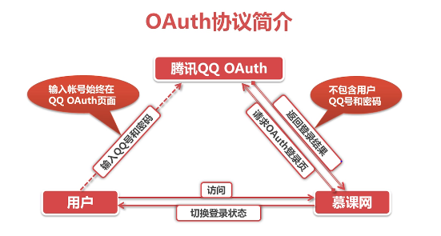
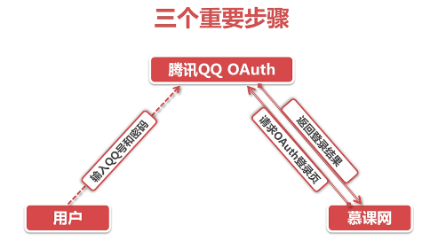
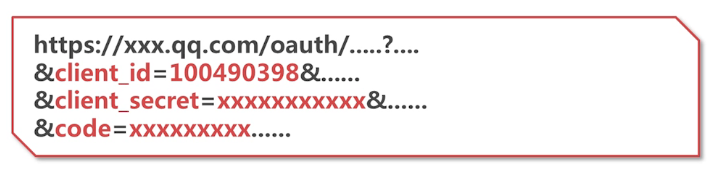
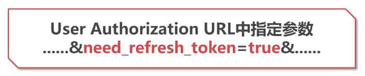

# OAuth入门

[TOC]

OAuth是Open Authorization的缩写。中文名称叫做开放授权。

OAuth就是不让第三方触及到用户的账户信息（如用户名，密码）。就可以申请获取该用户的资源信息。所以OAuth是安全的，开放的，简易的。

## OAuth协议

### OAuth流程简介

在上图中，我们看到，有如下步骤:

1. 用户访问原网站
2. 原网站请求目标网站的OAuth登陆页
3. 目标网站等待用户输入用户名密码，由于该网站和原网站不在一个域名下，所以是访问不到用户名和密码的信息的。
4. 登陆成功后，目标网站返回数据(这个过程很复杂，后续展开解释)

### OAuth版本

- OAuth 1.0发布在2007年末
- OAuth 2.0发布在2010年初

### OAuth应用场景模拟

- QQ用户授权原网站使用其QQ账号的信息
- 获取授权后，在**符合规则**的情况下访问各种API

## 重要的三个步骤

简化上图进行描述：

### 请求OAuth登陆页

- **Request Token URL** \- 未授权的令牌请求服务地址

  简单描述就是原网站请求目标网站时使用的**带有特定参数**的URL。这些参数可以在目标网站的特定服务网站注册自己网站信息之后，拿到唯一标识自己的`app_id(唯一)`和`app_key`，在用`app_id`和`app_key`请求URL获取令牌。

  ​

- **用户登陆成功后**

  由于原网站请求目标网站的OAuth服务时带的参数中包含一个回调地址。该地址用于用户在目标网站登陆成功后，目标网站跳转地址。跳转的URL会在原网站设定的回调地址上加上一段的加密数据。我们就可以在指定地址中使用PHP获取该加密数据。

  ​

- **返回登陆结果**

  在上一步中，原网站已经获取到了一个加密的数据。目标网站可以用这个数据确定用户登陆是成功的。但是只有该加密数据，原网站是无法获取目标网站的内容的，因为该数据可能被第三方劫持。所以，这个时候，需要原网站再次请求一个服务器地址，该地址称为`User Authorization URL` - 用户授权的令牌请求地址。

  就是用户登陆之后需要请求的**带有特定参数**的URL。该URL是在后端动态请求到的。该URL的一般形式如下：

  

  `client_id`和`client_secret`就是原网站注册得到的`app_id`和`app_key`。还要注意的是`code`是上一步授权之后得到的加密数据，该数据有过期时间的，由目标网站定义(有效时间很短一般就几秒)。目标网站就会检查这三项数据信息。

  目标网站响应用户信息。code有生命周期，且只能使用一次。

  ​

- **Access Token** - 用户通过访问第三方应用访问OAuth接口的令牌

  响应信息中还会包含一个`Access Token`。通过这个，原网站就可以使用用户的身份使用一些目标网站的服务，如分享到朋友圈之类的。

### Access Token与Refresh Token

`Access Token`也是具有生命周期的，具有较长的声明周期(10天到半个月之长)。

获取新的`Access Token`， 有两种方式，一种是：

- 拼接`User Authorization URL`中指定地址是加上一个指定的布尔型参数

  

  后台定时任务。例如：定时每天某个时刻发微博之类的。

  `Refresh Token`更长，可能几年之久。

- 重新进行一次OAuth，获取新的`Access Token`

